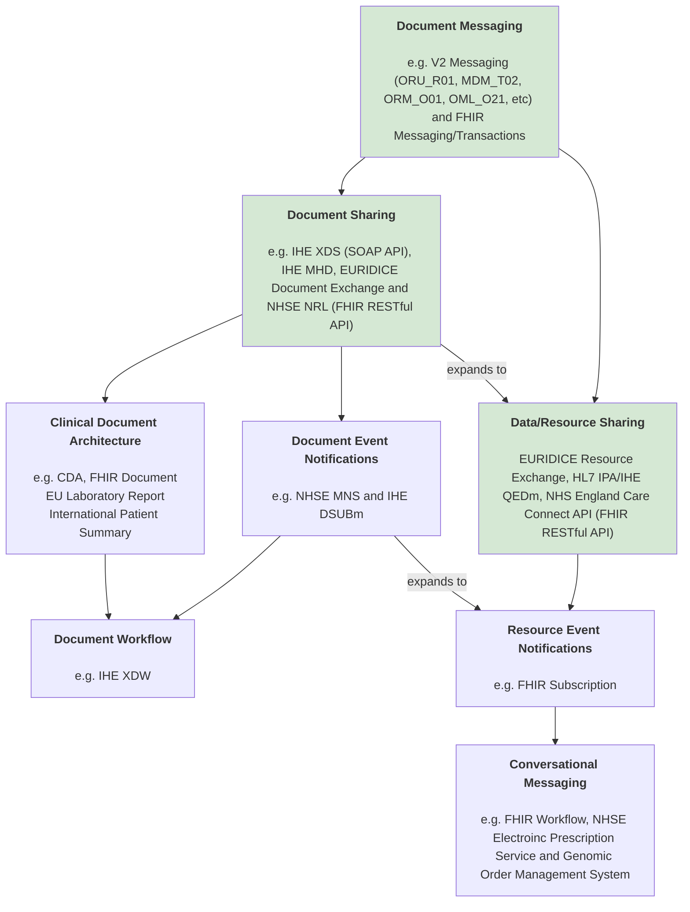
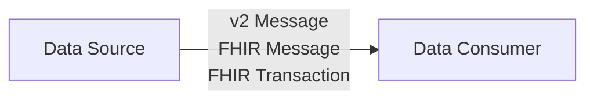
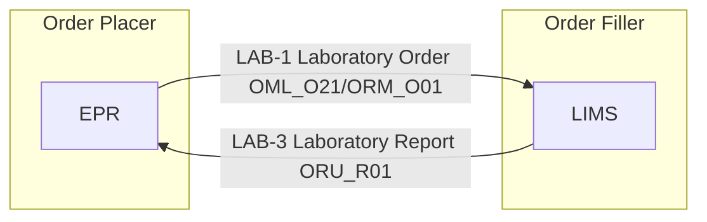
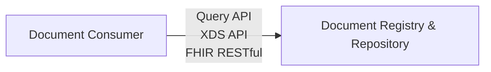
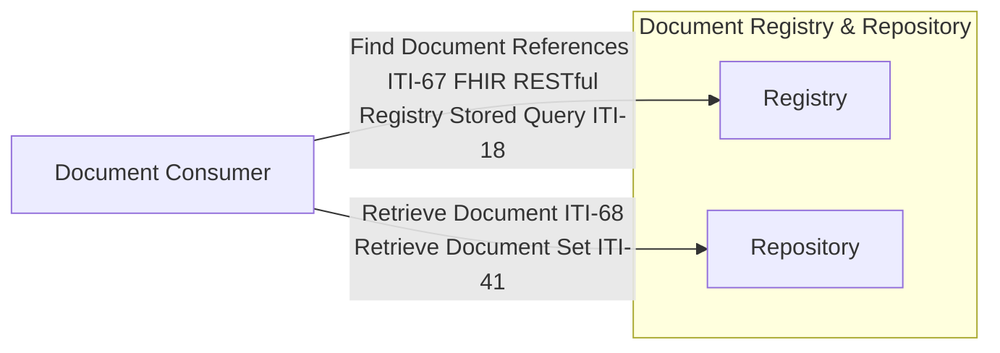
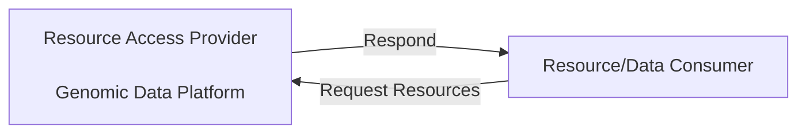
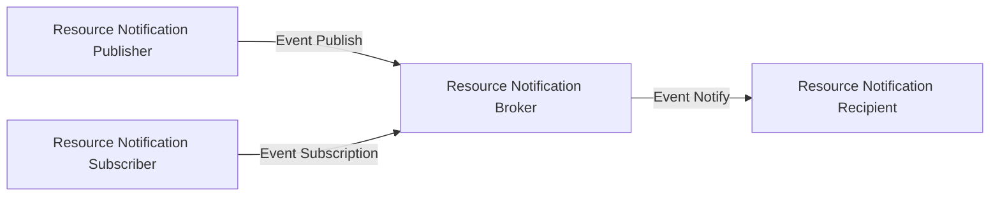
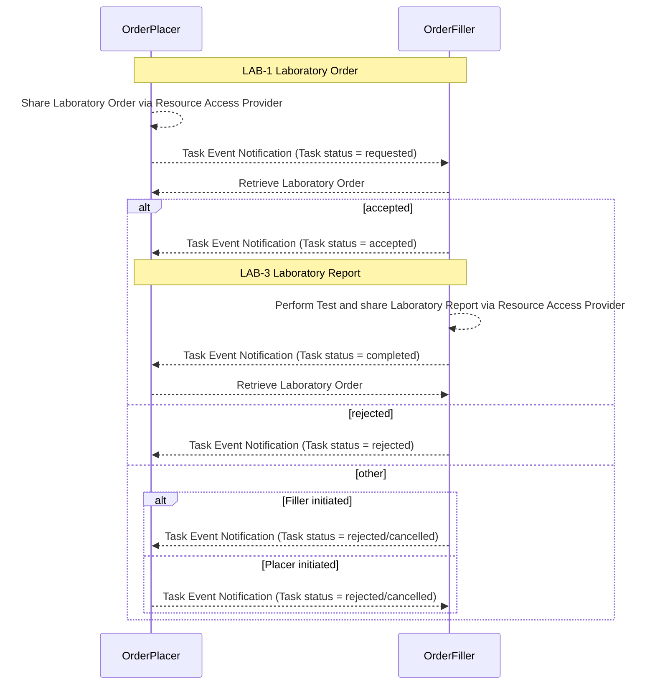

This diagram provides a high-level view of enterprise interoperability across the NHS. Most NHS Trusts have implemented some form of Document Messaging, typically through HL7 v2 messaging and, increasingly, FHIR-based transactions.

Many Shared Care Record providers (including the former LHCREs) have also established Document Sharing capabilities. Examples include One London, Lancashire & South Cumbria, and Cheshire & Merseyside, enabling clinical documents to be exchanged and consumed across organisational boundaries.

Several regions have progressed further by implementing Data/Resource Sharing in addition to document sharing. Examples include the Yorkshire & Humber Care Record, SiDER, and the Great North Care Record. These initiatives support the exchange of structured clinical data through APIs and shared resource models, moving beyond traditional document-centric interoperability.

Collectively, these Shared Care Record platforms are likely to form a significant foundation for the emerging Single Patient Record (SPR) landscape.

As a newly established diagnostic organisation (April 2026), we have already implemented all three interoperability layers—Document Messaging, Document Sharing, and Data/Resource Sharing—building upon capabilities developed prior to our formal establishment.

Our strategic ambition is to progress towards Conversational Messaging, which aligns with the direction being taken by national diagnostic services such as the Genomic Order Management Service (GOMS). Conversational Messaging supports structured request-response interactions between systems that mirror real-world business processes (for example, "Can you fulfil this request?" followed by an acceptance, rejection, or request for further information), enabling more dynamic and workflow-oriented interoperability.

Realising this model depends on widespread adoption of Data/Resource Sharing through capabilities such as the Single Patient Record (SPR) and FHIR APIs, together with national eventing services such as the NHS Multicast Notification Service (MNS). Without these foundations, organisations typically revert to point-to-point HL7 v2 messaging or FHIR transaction and bundle patterns, which are less effective for coordinating complex, multi-organisational workflows.

Importantly, both Document Messaging and Conversational Messaging are likely to play a role in addressing the "write-back" challenge frequently discussed in relation to SPR. Document Messaging provides a proven mechanism for distributing updates to consuming systems, whilst Conversational Messaging offers a more sophisticated approach for coordinating actions, acknowledgements, and workflow state changes across organisational boundaries.

 

Genomic Enterprise Integration
 
 

## Document Messaging

This basic patten is the exchange of records via [Document Messaging](https://www.enterpriseintegrationpatterns.com/patterns/messaging/DocumentMessage.html) and is supported by a wide area of [Messaging Patterns](https://www.enterpriseintegrationpatterns.com/patterns/messaging/index.html) 
In NHS Trusts this is often supported by a Trust Integration Engine.

### Example - Laboratory Testing Workflow

Is based on Document Messaging and two flows are combined to create a workflow e.g. [IHE Laboratory Testing Workflow (LTW)](LTW.html)

## Document Sharing

Document Messaging main limitation is it is between two parties, often in health care many other practitioners are involved. Messaging can be used to solve this but it begins to have scaling and data concurrency issues. 

### Example - Document Exchange

See also [Health Information Exchange - Document Exchange](HIE.html#document-exchange)

### Example - NHS England National Record Locator

See [NHS England National Record Locator](https://digital.nhs.uk/services/national-record-locator)

### Example - Cross Enterprise Document Sharing Laboratory 

Electronic Document Management (EDM) is a common practice for storing and sharing documents across healthcare systems and common formats for the documents are often PDF. In diagnostics this is not desirable and so instead a document format called [Clinical Document Architecture (CDA)](https://en.wikipedia.org/wiki/Clinical_Document_Architecture), in HL7 FHIR this is known as [FHIR Document](https://hl7.org/fhir/R4/documents.html)

This is described in [IHE https://wiki.ihe.net/index.php/Sharing_Laboratory_Reports](https://wiki.ihe.net/index.php/Sharing_Laboratory_Reports [HL7 Europe Laboratory Report](https://build.fhir.org/ig/hl7-eu/laboratory/), [NHS England Pathology](https://simplifier.net/guide/pathology-fhir-implementation-guide/Home/Design/How-to-Construct-Bundles?version=0.4.0) is a based on this but it using [Document Messaging](#document-messaging---generation-1), the EU is likely to use [Document Sharing](#document-sharing---generation-2).

## Document Event Notifications

Prerequisite is [Document Sharing](#document-sharing) 

### Example - Multicast Notifcation Service

See [NHS England Multicast Notification Service API](https://digital.nhs.uk/developer/api-catalogue/multicast-notification-service)

### Example - Document Subscription for Mobile (DSUBm)

See [IHE Document Subscription for Mobile (DSUBm)](https://profiles.ihe.net/ITI/DSUBm/index.html)

## Data Sharing

Can be considered an extension of Document Sharing where the data contained in the documents is queryable. This data is known as Resources and is related to Segments used in HL7 v2 Messaging.

This is the most common use of HL7 FHIR.

### Example - Resource Exchange

See also [Health Information Exchange - Resource Exchange](HIE.html#resource-exchange)

## Resource Event Notifications 

Prerequisite is [Data Sharing](#data-sharing) 

## Conversational Messaging (Resource/Data)

See [Conversation Patterns](https://www.enterpriseintegrationpatterns.com/patterns/messaging/Conversation.html)
For a FHIR implementation see [FHIR Worfklow](https://hl7.org/fhir/R4/workflow.html)

This is a replacement for [Document Messaging](#document-messaging) (i.e. HL7 v2, FHIR Messaging and FHIR Transaction)

Prerequisite is [Data Sharing](#data-sharing) and [Resource Event Notifications](#resource-event-notifications-), [polling](https://www.enterpriseintegrationpatterns.com/patterns/messaging/PollingConsumer.html) can be used as an interim measure if event notification infrastructure is not available.

### Example - NHS England Genomic Order Management System

See [NHS England Genomic Order Management System](https://simplifier.net/guide/FHIR-Genomics-Implementation-Guide/Home/Design/Interactions.page.md?version=current)

### Example - HL7 AU eRequesting 

See [AU eRequesting Implementation Guide](https://build.fhir.org/ig/hl7au/au-fhir-erequesting/)

### Example - NHS England Electronic Prescription Service

See [NHS England Electronic Prescription Service - Dispensing](https://simplifier.net/guide/NHSEngland-EPS/Home/Design/Dispensing?version=current)

## Conversational Messaging (Document)

### Example - IHE Cross-Enterprise Document Workflow Content Profile (XDW)

See [Cross-Enterprise Document Workflow Content Profile (XDW)](https://profiles.ihe.net/ITI/TF/Volume1/ch-30.html)
