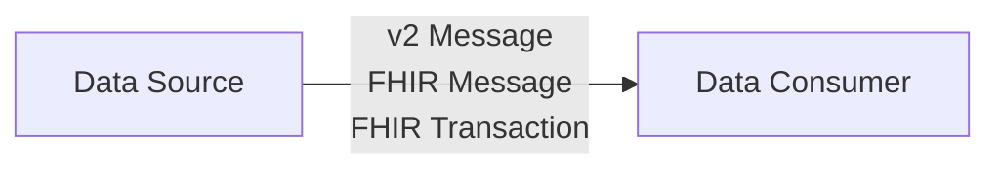
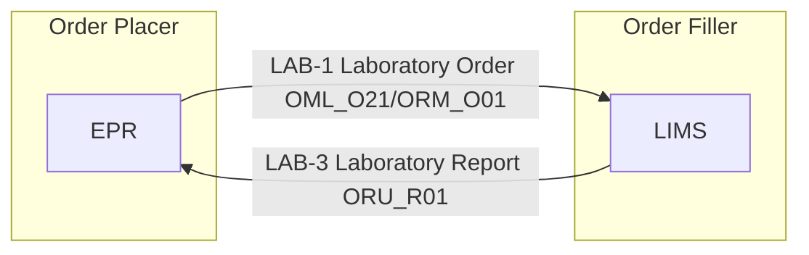
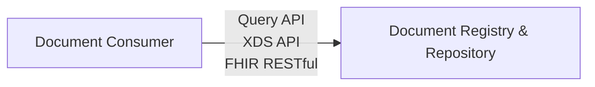
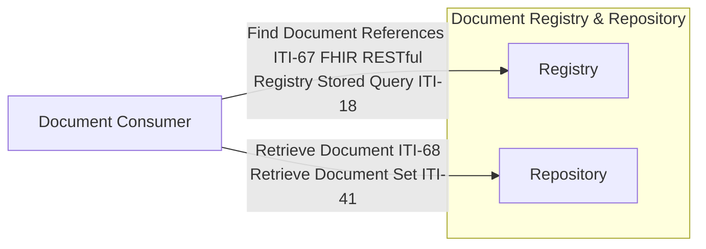

## Document Messaging - Generation 1

This basic patten is the exchange of records via [Document Messaging](https://www.enterpriseintegrationpatterns.com/patterns/messaging/DocumentMessage.html) and is supported by a wide area of [Messaging Patterns](https://www.enterpriseintegrationpatterns.com/patterns/messaging/index.html) 
In NHS Trusts this is often supported by a Trust Integration Engine.

### Example - Laboratory Testing Workflow

Is based on Document Messaging and two flows are combined to create a workflow e.g. [IHE Laboratory Testing Workflow (LTW)](LTW.html)

## Document Sharing - Generation 2

Document Messaging main limitation is it is between two parties, often in health care many other practitioners are involved. Messaging can be used to solve this but it begins to have scaling and data concurrency issues. 

### Example - Cross Enterprise Document Sharing

See also [Health Information Exchange - Document Exchange](HIE.html#document-exchange)

### Example - Cross Enterprise Document Sharing Laboratory 

Electronic Document Management (EDM) is a common practice for storing and sharing documents across healthcare systems and common formats for the documents are often PDF. In diagnostics this is not desirable and so instead a document format called [Clinical Document Architecture (CDA)](https://en.wikipedia.org/wiki/Clinical_Document_Architecture), in HL7 FHIR this is known as [FHIR Document](https://hl7.org/fhir/R4/documents.html)

This is the is described in [HL7 Europe Laboratory Report](https://build.fhir.org/ig/hl7-eu/laboratory/), [NHS England Pathology](https://simplifier.net/guide/pathology-fhir-implementation-guide/Home/Design/How-to-Construct-Bundles?version=0.4.0) is a based on this but it using [Document Messaging](#document-messaging---generation-1), the EU is likely to use [Document Sharing](#document-sharing---generation-2).

