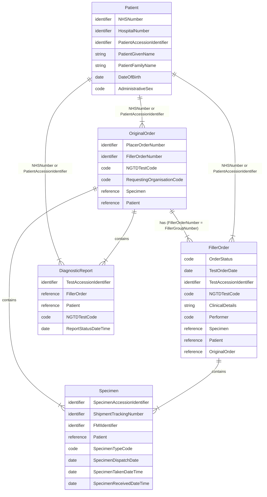

## Domain Archetype

## Patient 

See [Patient](StructureDefinition-Patient.html)

| Type       | Name                       | Description                                 | FHIR [Patient](StructureDefinition-Patient.html) |
|------------|----------------------------|---------------------------------------------|--------------------------------------------------|
| identifier | NHSNumber                  | Primary patient identifier                  | Patient.identifier (type=NH)                     |
| identifier | HospitalNumber             | Referring organisation local MRN identifier | Patient.identifier (type=MR)                     |
| identifier | PatientAccessionIdentifier | LIMS Patient identifier                     | Patient.identifier (type=PI)                     |
| string     | PatientGivenName           |                                             | Patient.name.given                               |
| string     | PatientFamilyName          |                                             | Patient.name.family                              |
| date       | DateOfBirth                |                                             | Patient.birthDate                                |
| code       | AdministrativeSex          |                                             | Patient.gender                                   |
{:.grid}

## Original Order

See also [Test Order](Questionnaire-GenomicTestOrder.html). The Original Order is distinguised from the Filler Order by value of intent, .

| Type       | Name                       | Description                         | FHIR [ServiceRequest](StructureDefinition-ServiceRequest.html) |
|------------|----------------------------|-------------------------------------|----------------------------------------------------------------|
| identifier | PlacerOrderNumber          |                                     | ServiceRequest.identifier (type = PLAC)                        |
| identifier | FillerOrderNumber          |                                     | ServiceRequest.identifier (type = FILL)                        |
| code       |                            |                                     | ServiceRequest.intent (code = original-order)                  | 
| code       | NGTDTestCode               | NGTD code for test                  | ServiceRequest.code                                            |
| string     | ClinicalDetails            | Referrer clinical notes             | ServiceRequest.note                                            |
| code       | RequestingOrganisationCode | ODS code of requesting organisation | ServiceRequest.requester (ODS Code)                            |
| code       | Performer                  |                                     | ServiceRequest.performer (fixed ODS code = 699X0)              |
| reference  | Specimen                   |                                     | ServiceRequest.specimen                                        |
| reference  | Patient                    |                                     | ServiceRequest.subject                                         |
{:.grid}

## Filler Order

| Type       | Name                       | Description                         | FHIR [ServiceRequest](StructureDefinition-ServiceRequest.html) |
|------------|----------------------------|-------------------------------------|----------------------------------------------------------------|
| code       | OrderStatus                | Order/test status                   | ServiceRequest.status                                          |
| date       | TestOrderDate              |                                     | ServiceRequest.authoredOn                                      |
| identifier | TestAccessionIdentifier    |                                     | ServiceRequest.identifier                                      |
| code       | NGTDTestCode               | NGTD code for test                  | ServiceRequest.code                                            |
| code       | RequestingOrganisationCode | ODS code of requesting organisation | ServiceRequest.requester (fixed ODS code = 699X0)              |
| code       | Performer                  |                                     | ServiceRequest.performer (ODS Code)                            |
| reference  | Specimen                   |                                     | ServiceRequest.specimen                                        |
| reference  | Patient                    |                                     | ServiceRequest.subject                                         |
| reference  | OriginalOrder              |                                     | ServiceRequest.requisition and ServiceRequest.basedOn          |
{:.grid}

### Filler Order Intent

| Type                | Description                                                                                                                                                     | IHE PALM | Created by   | Original Order Intent | Filler Order Intent   |
|---------------------|-----------------------------------------------------------------------------------------------------------------------------------------------------------------|----------|--------------|----------------------------------------|-----------------------|
| Laboratory Order    | A request for one or more laboratory investigations submitted by the requesting clinician or system.                                                            | LAB-1    | Order Placer | order / reflex                         |                       | 
| Work Order          | A subordinate order created by the laboratory to organise and fulfil part of the overall Laboratory Order.                                                      | LAB-4    | Order Filler |                                        | instance-order?       | 
| Subcontracted Order | A laboratory order forwarded to another laboratory for fulfilment, for example when a specialised test is referred to an external provider.                     | LAB-35   | Order Filler |                                        | order (filler-order?) |
| Reflex Order        | A new order created automatically by the Order Filler based on previous test results, for example when pathology findings automatically trigger a genomic test. | LAB-35   | Order Filler |                                        | reflex                | 
{:.grid}

## Specimen 

See also [Test Order - Specimen](Questionnaire-GenomicTestOrder.html#specimen)

| Type       | Name                        | Description             | FHIR [Specimen](StructureDefinition-Specimen.html)       |
|------------|-----------------------------|-------------------------|----------------------------------------------------------|
| identifier | SpecimenAccessionIdentifier |                         | Specimen.identifier                                      |
| identifier | ShipmentTrackingNumber      | Courier tracking number | Specimen.identifier[ShipmentTrackingNumber] (type = STN) |
| identifier | FMIIdentifier               |                         | Specimen.container.identifier                            |
| reference  | Patient                     |                         | Specimen.subject                                         |
| code       | SpecimenTypeCode            |                         | Specimen.type                                            |
| date       | SpecimenDispatchDate        |                         |                                                          |
| date       | SpecimenTakenDateTime       | Collection date/time    | Specimen.collection.collectedDateTime                    |
| date       | SpecimenReceivedDateTime    | Received date/time      |                                                          |
{:.grid}

## Diagnostic Report

See also [Test Report](Questionnaire-GenomicTestReport.html)

| Type       | Name                    | Description | FHIR [DiagnosticReport](StructureDefinition-DiagnosticReport.html)                           |
|------------|-------------------------|-------------|----------------------------------------------------------------------------------------------|
| identifier | TestAccessionIdentifier |             | DiagnosticReport.identifier                                                                  |
| reference  | FillerOrder             |             | DiagnosticReport.basedOn (FillerOrder)                                                       |
| reference  | Patient                 |             | DiagnosticReport.subject                                                                     |
| code       | NGTDTestCode            |             | DiagnosticReport.code (system = https://fhir.nhs.uk/CodeSystem/England-GenomicTestDirectory) |
| date       | ReportStatusDateTime    |             | DiagnosticReport.effectiveDateTime                                                           |
{:.grid}

