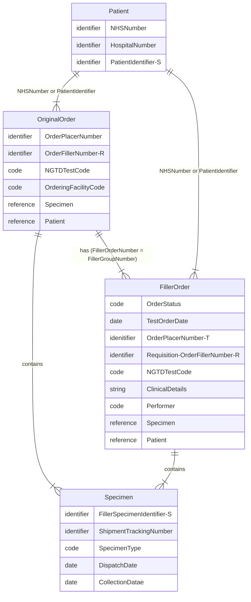

## Domain Archetype

## Patient 

See [Patient](StructureDefinition-Patient.html)

## Specimen 

See also [Test Order - Specimen](Questionnaire-GenomicTestOrder.html#specimen)

| Name                                  | iGene CSV | FHIR                                                                             |
|---------------------------------------|-----------|----------------------------------------------------------------------------------| 
| identifier FillerSpecimenIdentifier-S | SpecimenAccessionIdentifier          | [Specimen](StructureDefinition-Specimen.html).identifier[FillerSpecimenNumber]   |
| ShipmentTrackingNumber                | ShipmentTrackingNumber          | [Specimen](StructureDefinition-Specimen.html).identifier[ShipmentTrackingNumber] |
| SpecimenType                          | SpecimenTypeDescription          | [Specimen](StructureDefinition-Specimen.html).type                               |
| DispatchDate                          | SpecimenDispatchDate          | Task? [Work Order](StructureDefinition-WorkOrder.html)                                                             |
| CollectionDatae                       | SpecimenTakenDateTime          | [Specimen](StructureDefinition-Specimen.html).collection.collectedDateTime       |
{:.grid}

## Original Order 

See also [Test Order](Questionnaire-GenomicTestOrder.html)

| Name                            | iGene CSV                 | FHIR                                                                                         | 
|---------------------------------|---------------------------|----------------------------------------------------------------------------------------------| 
| intent                          |                           | [ServiceRequest](StructureDefinition-ServiceRequest.html).intent = original-order (or order) |
{:.grid}

## Reflex Order

| Name                            | iGene CSV                 | FHIR                                                                                  | 
|---------------------------------|---------------------------|---------------------------------------------------------------------------------------| 
| OrderStatus                     | OrderStatus               | Task? [Work Order](StructureDefinition-WorkOrder.html)                                                                                |
| intent                          |                           | [ServiceRequest](StructureDefinition-ServiceRequest.html).intent = reflex             |
| TestOrderDate                   | TestOrderDate             | [ServiceRequest](StructureDefinition-ServiceRequest.html).authoredOn                  | 
| OrderPlacerNumber-T             | TestAccessionIdentifier   | [ServiceRequest](StructureDefinition-ServiceRequest.html).identifier[OrderIdentifier] |
| Requisition-OrderFillerNumber-R | FillerOrderNumber         | [ServiceRequest](StructureDefinition-ServiceRequest.html).requisition                 |
| NGTDTestCode                    | NGTDTestCode              | [ServiceRequest](StructureDefinition-ServiceRequest.html).code                        |
| ClinicalDetails                 | ClinicalDetails           | [ServiceRequest](StructureDefinition-ServiceRequest.html).note                        |
| Performer                       | DatasetTargetOrganisation | [ServiceRequest](StructureDefinition-ServiceRequest.html).performer                   |
{:.grid}

