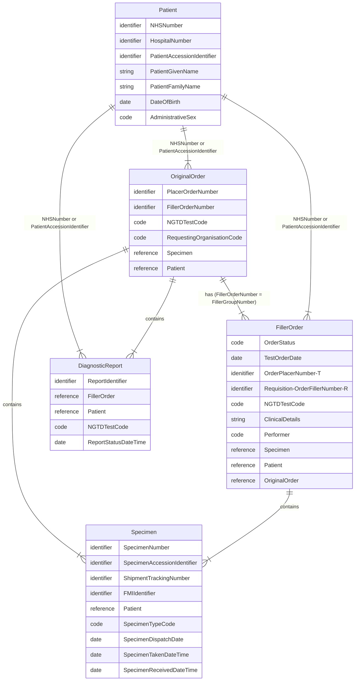

## Domain Archetype

## Patient 

See [Patient](StructureDefinition-Patient.html)

| Type       | Name                       | FHIR Patient                 |
|------------|----------------------------|------------------------------|
| identifier | NHSNumber                  | Patient.identifier (type=NH) |
| identifier | HospitalNumber             | Patient.identifier (type=MR) |
| identifier | PatientAccessionIdentifier | Patient.identifier (type=PI) |
| string     | PatientGivenName           | Patient.name.given           |
| string     | PatientFamilyName          | Patient.name.family          |
| date       | DateOfBirth                | Patient.birthDate            |
| code       | AdministrativeSex          | Patient.gender               |
{:.grid}

## Specimen 

See also [Test Order - Specimen](Questionnaire-GenomicTestOrder.html#specimen)

| Name                                  | iGene CSV | FHIR                                                                             |
|---------------------------------------|-----------|----------------------------------------------------------------------------------| 
| identifier FillerSpecimenIdentifier-S | SpecimenAccessionIdentifier          | [Specimen](StructureDefinition-Specimen.html).identifier[FillerSpecimenNumber]   |
| ShipmentTrackingNumber                | ShipmentTrackingNumber          | [Specimen](StructureDefinition-Specimen.html).identifier[ShipmentTrackingNumber] |
| SpecimenType                          | SpecimenTypeDescription          | [Specimen](StructureDefinition-Specimen.html).type                               |
| DispatchDate                          | SpecimenDispatchDate          | Task? [Work Order](StructureDefinition-WorkOrder.html)                                                             |
| CollectionDatae                       | SpecimenTakenDateTime          | [Specimen](StructureDefinition-Specimen.html).collection.collectedDateTime       |
{:.grid}

## Original Order 

See also [Test Order](Questionnaire-GenomicTestOrder.html)

| Name                            | iGene CSV                 | FHIR                                                                                         | 
|---------------------------------|---------------------------|----------------------------------------------------------------------------------------------| 
| intent                          |                           | [ServiceRequest](StructureDefinition-ServiceRequest.html).intent = original-order (or order) |
{:.grid}

## Filler Order

| Name                            | iGene CSV                 | FHIR                                                                                 | 
|---------------------------------|---------------------------|--------------------------------------------------------------------------------------| 
| OrderStatus                     | OrderStatus               | Task? [Work Order](StructureDefinition-WorkOrder.html)                               |
| [intent](#filler-order-intent)  |                           | [ServiceRequest](StructureDefinition-ServiceRequest.html).intent                     |
| TestOrderDate                   | TestOrderDate             | [ServiceRequest](StructureDefinition-ServiceRequest.html).authoredOn                 | 
| OrderPlacerNumber-T             | TestAccessionIdentifier   | [ServiceRequest](StructureDefinition-ServiceRequest.html).identifier[OrderIdentifier] |
| Requisition-OrderFillerNumber-R | FillerOrderNumber         | [ServiceRequest](StructureDefinition-ServiceRequest.html).requisition                |
| NGTDTestCode                    | NGTDTestCode              | [ServiceRequest](StructureDefinition-ServiceRequest.html).code                       |
| ClinicalDetails                 | ClinicalDetails           | [ServiceRequest](StructureDefinition-ServiceRequest.html).note                       |
| Performer                       | DatasetTargetOrganisation | [ServiceRequest](StructureDefinition-ServiceRequest.html).performer                  |
{:.grid}

## Filler Order Intent

| Type                | Description                                                                                                                                                     | IHE PALM | Created by   | Original Order Intent | Filler Order Intent   |
|---------------------|-----------------------------------------------------------------------------------------------------------------------------------------------------------------|----------|--------------|----------------------------------------|-----------------------|
| Laboratory Order    | A request for one or more laboratory investigations submitted by the requesting clinician or system.                                                            | LAB-1    | Order Placer | order / reflex                         |                       | 
| Work Order          | A subordinate order created by the laboratory to organise and fulfil part of the overall Laboratory Order.                                                      | LAB-4    | Order Filler |                                        | instance-order?       | 
| Subcontracted Order | A laboratory order forwarded to another laboratory for fulfilment, for example when a specialised test is referred to an external provider.                     | LAB-35   | Order Filler |                                        | order (filler-order?) |
| Reflex Order        | A new order created automatically by the Order Filler based on previous test results, for example when pathology findings automatically trigger a genomic test. | LAB-35   | Order Filler |                                        | reflex                | 
{:.grid}
