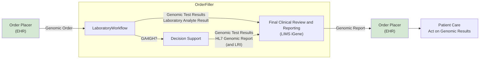
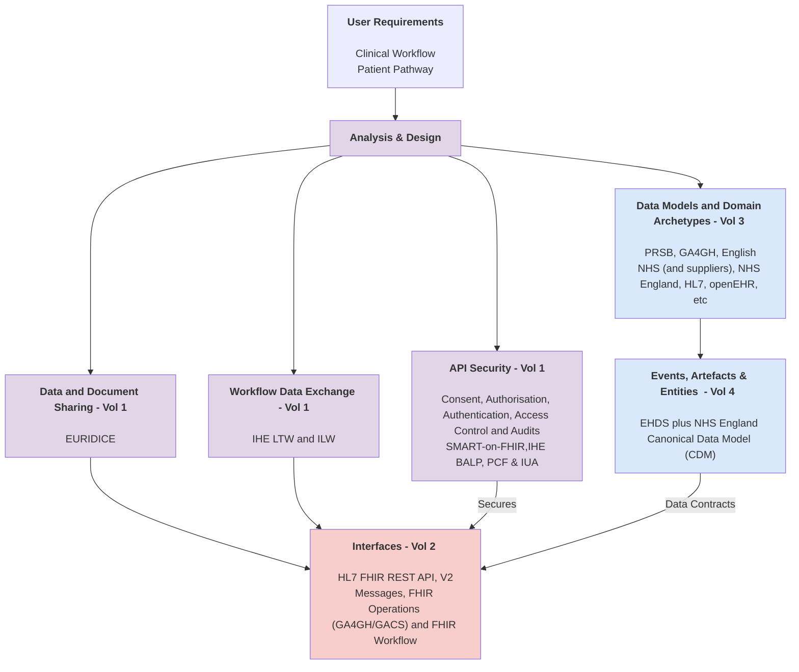

## Overview

Diagnostic testing is essential to modern clinical care, offering objective information that supports decision-making at every stage of a patient’s journey—from initial evaluation to long-term monitoring and assessment of outcomes.

Genomic diagnostic testing contributes to this process by examining a patient’s DNA or RNA to detect genetic variations that influence disease susceptibility, diagnosis, treatment choices, and prognosis. By delivering highly specific and personalised insights, genomic testing improves the accuracy and effectiveness of clinical management.

A Genomic Order is initiated by the Order Placer (EHR) and sent to the Order Filler, where the Laboratory Workflow manages the test process. Laboratory analyte results are generated and may be combined with Decision Support, including GA4GH-based inputs, to aid interpretation. The resulting Test Results are represented as an HL7 Genomic Report (and LRI) and reviewed during Final Clinical Review and Reporting (LIMS iGene). A validated Genomic Report is then returned to the Order Placer (EHR), enabling clinicians to Act on Genomic Results in patient care.

<!--
 -->

 

NHS North West Genomics is a new regional NHS service that consolidates clinical genomic testing across the North West of England. Although the service is delivered regionally, it also processes genomic test requests from across the UK. The service is hosted by Manchester University NHS Foundation Trust.

As part of the service transition, existing systems for electronic test ordering and reporting will be enhanced through the introduction of a Regional Orchestration Engine (ROE) and a Genomic Data Platform. These components enable seamless data exchange between local clinical systems and regional genomic laboratory services.

 

## How to Read this IG

<table >
  <thead>
    <tr>
      <th></th>
      <th>Menu Item</th>
      <th>Description</th>
      <th>Audience</th>
    </tr>
  </thead>
  <tbody>
    <tr>
      <td style="background-color: #E1D5E7">&nbsp;&nbsp;</td>
      <td>Analysis and Design (Volume 1)</td>
      <td>Description of the processes and corresponding technical frameworks</td>
      <td>General (Users, Enterprise Architects, Business Analysts, and Staff Software Engineers)</td>
    </tr>
    <tr>
      <td style="background-color: #F8CECC">&nbsp;&nbsp;</td>
      <td>Interfaces (Volume 2)</td>
      <td>Description of the processes and corresponding technical frameworks (HL7 v2 and FHIR Interactions)</td>
      <td>Technical Design (Developer)</td>
    </tr>
    <tr>
      <td style="background-color: #DAE8FC">&nbsp;&nbsp;</td>
      <td>Data Models (Volume 3)</td>
      <td>NHS North West Forms, Templates, Reports, and Compositions</td>
      <td>Data Modeling (Clinical Informatics and Business Analysts)</td>
    </tr>
    <tr>
      <td style="background-color: #DAE8FC">&nbsp;&nbsp;</td>
      <td>Artefacts (Volume 4)</td>
      <td>NHS North West Common Data Models</td>
      <td>Data Modeling (Data Engineering)</td>
    </tr>
    <tr>
      <td style="background-color: #F8CECC">&nbsp;&nbsp;</td>
      <td>Development</td>
      <td>Testing, Suppport and Architecture</td>
      <td>Technical (Developer)</td>
    </tr>
  </tbody>
</table>

| Diagnostic Process              | Analysis and Design | Interfaces                                                                               | Domain Archetype                                                                                                                                                                                | 
|---------------------------------|--------------------------------------------------------------------|------------------------------------------------------------------------------------------|-------------------------------------------------------------------------------------------------------------------------------------------------------------------------------------------------|
| <b>Test Workflow Management</b> | [Laboratory Testing Workflow (LTW)](LTW.html)                      | [FHIR Workflow](https://hl7.org/fhir/R4/workflow.html) LAB-4 and LAB-5                   | [Work Order](StructureDefinition-WorkOrder.html)   [Laboratory Analyte Result](StructureDefinition-LaboratoryAnalyteResult.html)                                                            | 
| <b>Laboratory Order</b>         | [Laboratory Testing Workflow (LTW)](LTW.html)                      | [Message Exchange [MQ]](MQ.html) LAB-1                                                   | [North West Genomics Test Order](StructureDefinition-ServiceRequest.html)                                                                                                                           |                              
|                                 | [Health Data API (HIE/EURDICE)](HIE.html)                          | [Resource Access [IPA/QEDm]](QEDm.html)                                                  |                                                                                                                                                                                                 |                                                     
|                                 | [Inter Laboratory Workflow (ILW)](ILW.html)                        | [Message Exchange [MQ]](MQ.html)                                                         |                                                                                                                                                                                                 |
| <b>Laboratory Report</b>        | [Laboratory Testing Workflow (LTW)](LTW.html)                      | [Message Exchange [MQ]](MQ.html) LAB-3   [Document Exchange [MHD]](MHD.html) MDM_T02 | [North West Genomics Test Report](StructureDefinition-DiagnosticReport.html)                                                                                                                         | 
|                                 | [Health Data API (HIE/EURDICE)](HIE.html)                          | [Resource Access [IPA/QEDm]](QEDm.html)                                                  |                                                                                                                                                                                                 | 
|                                 | [Health Data API (HIE/EURDICE)](HIE.html)                          | [Document Exchange [MHD]](MHD.html) ITI-67 ITI-68                                        | [DocumentReference[MHD]/Document Entry[XDS]](StructureDefinition-DocumentReference.html)  plus Future - FHIR Document [HL7 Europe Laboratory Report](https://hl7.eu/fhir/laboratory/2.0.0/) | 
| <b>Specimen Collection</b>      | Future - IHE Specimen Event Tracking (SET)                         | [Resource Access [IPA/QEDm]](QEDm.html)                                                  |                                                                                                                                                                                                 |                                                  
| API Security                    | [API Security](api-security.html)                                  | [Authorisation [IUA]](IUA.html) OAuth2                                                   |                                                                                                                                                                                                 |                                                                                               
{:.grid}

## Use Cases

Real-world scenarios this IG is built against, each linking to the relevant
Analysis and Design (Volume 1) and Data Model (Volume 3) material plus its own
worked-example page - see the **Use Cases** menu for the full list.

| Use Case                                              | Analysis and Design (Volume 1)                                              | Data Model (Volume 3)                                                                                                    | Use Case Page                                                                    |
|--------------------------------------------------------|-------------------------------------------------------------------------------|------------------------------------------------------------------------------------------------------------------------------|-------------------------------------------------------------------------------------|
| Distributed WGS (dWGS)                                  | [ILW - Sub-orders LAB-35/LAB-36](ILW.html#sub-orders-lab-35-and-lab-36)        | [dWGS Sub-Order Manifest](Questionnaire-dWGSSubOrder.html) under [ServiceRequest](ServiceRequest.html)                        | [dWGS](dWGS.html)                                                                    |
| Histocompatibility and Immunogenetics                   | [LTW - LAB-1 Process Flow](LTW.html#lab-1-process-flow)                       | [Histocompatibility Ask At Order Entry](Questionnaire-HistocompatibilityAskAtOrderEntry.html) under [ServiceRequest](ServiceRequest.html#order-entry-questions) | [Histocompatibility and Immunogenetics](HistocompatibilityAndImmunogenetics.html)    |
| BCR-ABL Monitoring (Cepheid ASTM to iGene)              | [LTW - Test Results Management (LAB-5)](LTW.html#test-results-management-lab-5) | [Laboratory Analyte Result](StructureDefinition-LaboratoryAnalyteResult.html)                                                | [BCR-ABL Monitoring](BCRABLMonitoring.html)                                          |
| Haemato-Oncology Diagnostic Pathway (Shire to HODS)     | [ILW - Sub-orders LAB-35/LAB-36](ILW.html#sub-orders-lab-35-and-lab-36)        | [ServiceRequest](StructureDefinition-ServiceRequest.html) / [DiagnosticReport](StructureDefinition-DiagnosticReport.html)     | [Haemato-Oncology Diagnostic Pathway](HaematoOncologyPathway.html)                   |
| Cheshire and Merseyside (Pathology to Genomics Reflex)  | [LTW - LAB-1/LAB-3 Process Flow](LTW.html#lab-1-process-flow)                 | [ServiceRequest](StructureDefinition-ServiceRequest.html) / [DiagnosticReport](StructureDefinition-DiagnosticReport.html)     | [Cheshire and Merseyside Pathology](CheshireAndMerseysidePathology.html) |
| Cancer NOS (Colorectal and Children's Cancer Pathways)  | [LTW - LAB-1/LAB-3 Process Flow](LTW.html#lab-1-process-flow)                 | [ServiceRequest](StructureDefinition-ServiceRequest.html) / [DiagnosticReport](StructureDefinition-DiagnosticReport.html)     | [Cancer NOS](CancerNOS.html)                                                         |
| OMICS DSS Result Integration                            | [LTW - Work Order Management (LAB-4)](LTW.html#work-order-management-lab-4)   | [DiagnosticReport](StructureDefinition-DiagnosticReport.html)                                                                | [OMICS DSS](reportable-variants.html)                                                |
| Regional Orders and Reports (Alder Hey, MFT, Liverpool) | [LTW - LAB-1/LAB-3 Process Flow](LTW.html#lab-1-process-flow)                 | [ServiceRequest](StructureDefinition-ServiceRequest.html) / [DiagnosticReport](StructureDefinition-DiagnosticReport.html)     | [Regional Integration Engine (RIE)](overview.html)                                   |
| Greater Manchester Care Record (GMCR)                   | [HIE - Sharing Laboratory Reports (Resource)](HIE.html#sharing-laboratory-reports-resource)                       | [DocumentReference](StructureDefinition-DocumentReference.html)                                                              | [RIE - Shared Care Record Feeds](overview.html#shared-care-record-feeds---wire-tap-on-lab-3oru_r01) |
| Lancashire and South Cumbria Genomic Reports            | [HIE - Sharing Laboratory Reports (Resource)](HIE.html#sharing-laboratory-reports-resource)                       | [DocumentReference](StructureDefinition-DocumentReference.html)                                                              | [RIE - Shared Care Record Feeds](overview.html#shared-care-record-feeds---wire-tap-on-lab-3oru_r01) |
| ctDNA NHS England Unified Genomic Record Phase 1        | [HIE - Sharing Laboratory Reports (Resource)](HIE.html#sharing-laboratory-reports-resource)                       | [DocumentReference](StructureDefinition-DocumentReference.html)                                                              | [RIE - Shared Care Record Feeds](overview.html#shared-care-record-feeds---wire-tap-on-lab-3oru_r01) |
| NE&Y Management Information (ctDNA)                     | [LTW - LAB-1/LAB-3 Process Flow](LTW.html#lab-1-process-flow)                 | [ServiceRequest](StructureDefinition-ServiceRequest.html) / [DiagnosticReport](StructureDefinition-DiagnosticReport.html)     | [RIE - Technical Detail](overview.html#technical-detail)                             |
{:.grid}

## SNOMED CT

UK edition of SNOMED (83821000000107)

## Dependencies



## Credits

| Role(s)        | Contributor(s)                                             | 
|----------------|------------------------------------------------------------|
|                | North West Genomic Medicine Service Alliance               |
|                | North East and Yorkshire Genomic Medicine Service Alliance |
|                | Alder Hey Children's Hospital Trust                        |
|                | Manchester University NHS Foundation Trust                 |
|                | Liverpool Womens NHS Foundation Trust                      |
|                | The Christie NHS Foundation Trust                          |
|                | NHS England                                                |
| Staff Engineer | Kevin Mayfield, Aire Logic & Mayfield IS                   |  
{:.grid}
