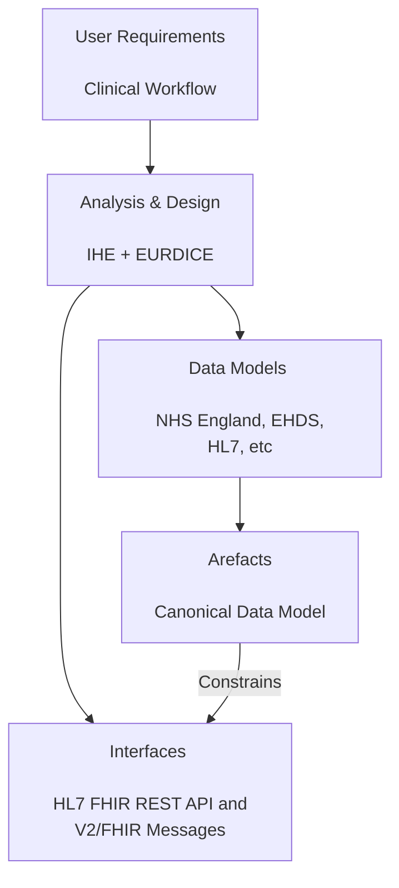

## Overview

Diagnostic testing is essential to modern clinical care, offering objective information that supports decision-making at every stage of a patient’s journey—from initial evaluation to long-term monitoring and assessment of outcomes.

Genomic diagnostic testing contributes to this process by examining a patient’s DNA or RNA to detect genetic variations that influence disease susceptibility, diagnosis, treatment choices, and prognosis. By delivering highly specific and personalised insights, genomic testing improves the accuracy and effectiveness of clinical management.

<!--
 -->

 

NHS North West Genomics is a new regional NHS service that consolidates clinical genomic testing across the North West of England. Although the service is delivered regionally, it also processes genomic test requests from across the UK. The service is hosted by Manchester University NHS Foundation Trust.

As part of the service transition, existing systems for electronic test ordering and reporting will be enhanced through the introduction of a Regional Orchestration Engine (ROE) and a Genomic Data Platform. These components enable seamless data exchange between local clinical systems and regional genomic laboratory services.

 

| Diagnostic Process              | Analysis and Design                                | Interfaces                                                                               | Domain Archetype                                                                                                                                                                                | 
|---------------------------------|----------------------------------------------------|------------------------------------------------------------------------------------------|-------------------------------------------------------------------------------------------------------------------------------------------------------------------------------------------------|
| <b>Test Workflow Management</b> | [Laboratory Testing Workflow (LTW)](LTW.html)      | [FHIR Workflow](https://hl7.org/fhir/R4/workflow.html) LAB-4 and LAB-5                   | [Work Order](StructureDefinition-WorkOrder.html)   [Laboratory Analyte Result](StructureDefinition-LaboratoryAnalyteResult.html)                                                            | 
| <b>Laboratory Order</b>         | [Laboratory Testing Workflow (LTW)](LTW.html)      | [Message Exchange [MQ]](MQ.html) LAB-1                                                   | [North West Genomics Test Order](Questionnaire-GenomicTestOrder.html)                                                                                                                           |                              
|                                 | [Health Data API (HIE/EURDICE)](HIE.html)          | [Resource Access [IPA/QEDm]](QEDm.html)                                                  |                                                                                                                                                                                                 |                                                     
|                                 | [Inter Laboratory Workflow (ILW)](ILW.html)        | [Message Exchange [MQ]](MQ.html)                                                         |                                                                                                                                                                                                 |
| <b>Laboratory Report<b/>        | [Laboratory Testing Workflow (LTW)](LTW.html)      | [Message Exchange [MQ]](MQ.html) LAB-3   [Document Exchange [MHD]](MHD.html) MDM_T02 | [North West Genomics Test Report](Questionnaire-GenomicTestReport.html)                                                                                                                         | 
|                                 | [Health Data API (HIE/EURDICE)](HIE.html)          | [Resource Access [IPA/QEDm]](QEDm.html)                                                  |                                                                                                                                                                                                 | 
|                                 | [Health Data API (HIE/EURDICE)](HIE.html)          | [Document Exchange [MHD]](MHD.html) ITI-67 ITI-68                                        | [DocumentReference[MHD]/Document Entry[XDS]](StructureDefinition-DocumentReference.html)  plus Future - FHIR Document [HL7 Europe Laboratory Report](https://hl7.eu/fhir/laboratory/2.0.0/) | 
| <b>Specimen Collection</b>      | Future - [Specimen Event Tracking (SET)](SET.html) | [Resource Access [IPA/QEDm]](QEDm.html)                                                  |                                                                                                                                                                                                 |                                                  
| API Security                    | [API Security](api-security.html)                  | [Authorisation [IUA]](IUA.html) OAuth2                                                   |                                                                                                                                                                                                 |                                                                                               
{:.grid}

## How to Read this IG

<table >
  <thead>
    <tr>
      <th></th>
      <th>Menu Item</th>
      <th>Description</th>
      <th>Audience</th>
    </tr>
  </thead>
  <tbody>
    <tr>
      <td style="background-color: #E1D5E7">&nbsp;&nbsp;</td>
      <td>Analysis and Design (Volume 1)</td>
      <td>Description of the processes and corresponding technical frameworks</td>
      <td>General</td>
    </tr>
    <tr>
      <td style="background-color: #F8CECC">&nbsp;&nbsp;</td>
      <td>Interfaces (Volume 2)</td>
      <td>Description of the processes and corresponding technical frameworks (HL7 v2 and FHIR Interactions)</td>
      <td>Detailed Technical (Integration Developer)</td>
    </tr>
    <tr>
      <td style="background-color: #DAE8FC">&nbsp;&nbsp;</td>
      <td>Data Models (Volume 3)</td>
      <td>NHS North West Forms, Templates, Reports, and Compositions</td>
      <td>Data Modeling (Detailed Technical)</td>
    </tr>
    <tr>
      <td style="background-color: #DAE8FC">&nbsp;&nbsp;</td>
      <td>Artefacts (Volume 4)</td>
      <td>NHS North West Common Data Models</td>
      <td>Detailed Technical</td>
    </tr>
    <tr>
      <td style="background-color: #DAE8FC">&nbsp;&nbsp;</td>
      <td>Development</td>
      <td>Testing, Suppport and Architecture</td>
      <td>Detailed Technical (Developer)</td>
    </tr>
  </tbody>
</table>

## SNOMED CT

UK edition of SNOMED (83821000000107)

## Dependencies



## Credits

| Role(s)        | Contributor(s)                               | 
|----------------|----------------------------------------------|
|                | North West Genomic Medicine Service Alliance |
|                | Alder Hey Children's Hospital Trust          |
|                | Manchester University NHS Foundation Trust   |
|                | Liverpool Womens NHS Foundation Trust        |
|                | The Christie NHS Foundation Trust            |
|                | NHS England                                  |
| Staff Engineer | Kevin Mayfield, Aire Logic & Mayfield IS     |  
{:.grid}
