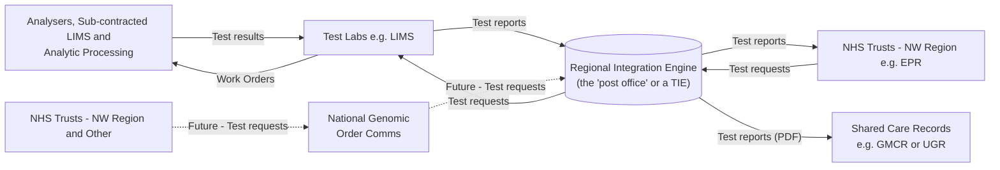
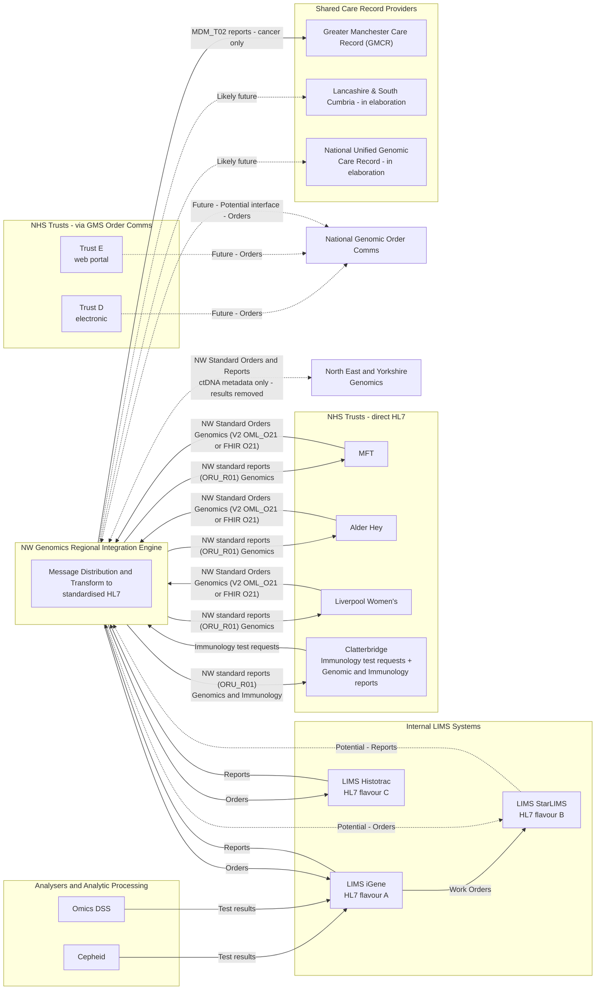

# NW Genomics Regional Integration Engine (RIE)

## Overview (non-technical)

Think of the Regional Integration Engine (RIE) as a **post office for genomic test information** across North West Genomics.

- **Test labs** (the LIMS systems that process genomic tests) send their results to the RIE.
- The RIE **translates and sorts** these results into a standard format.
- The RIE **delivers** results to NHS Trusts in the North West region, and also shares them (as PDF documents) with shared care record systems, like the Greater Manchester Care Record, so a patient's wider care team can see them.

Test requests work the same way in reverse: an NHS Trust orders a test, the RIE passes it to the right lab in the format that lab needs. North West Trusts can send requests directly to the RIE, while Trusts from the North West and elsewhere can also order through a national ordering system / web portal.

### Simplified diagram

## Technical detail

The NW Genomics Regional Integration Engine (RIE) acts as a central messaging hub — effectively a "post office" — for North West Genomics.

The RIE handles message distribution and transformation to standardised HL7, distributing orders and reports to NHS Trusts. It has the potential to interface with national order comms systems, including the one currently in development by the NHS Genomic Medicine Service, for receiving standardised orders.

A second group of NHS Trusts create orders via the NHS Genomic Medicine Service Order Comms system, either electronically or through its web portal, rather than sending standardised HL7 orders directly to the RIE.

The RIE connects to multiple internal LIMS systems — including iGene, StarLIMS, and others — each using its own variant of HL7 messaging. It transforms these into standardised report messages for consumption by NHS Trusts. In the reverse direction, standardised orders received from NHS Trusts (or potentially national order comms) are transformed by the RIE into the appropriate HL7 flavour for each destination LIMS.

Reports are also sent to shared care record providers using HL7 MDM_T02, currently for the Greater Manchester Care Record (GMCR) — this feed is cancer only. Similar services are likely to be provided to Lancashire and South Cumbria, and to the national Unified Genomic Care Record.

The RIE also exchanges NW standard orders and reports with North East and Yorkshire Genomics, as a peer Genomic Laboratory Hub — ctDNA metadata only, with results removed.

> **Note:** Test Results and Work Orders also flow via the RIE, this is not shown in the diagram to aid clarity.

### Technical diagram

