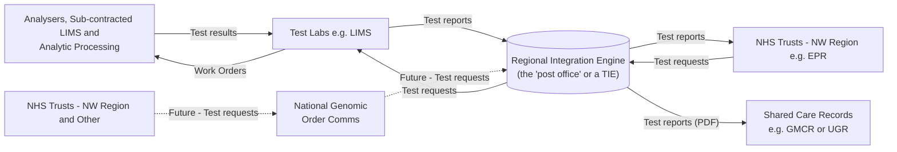
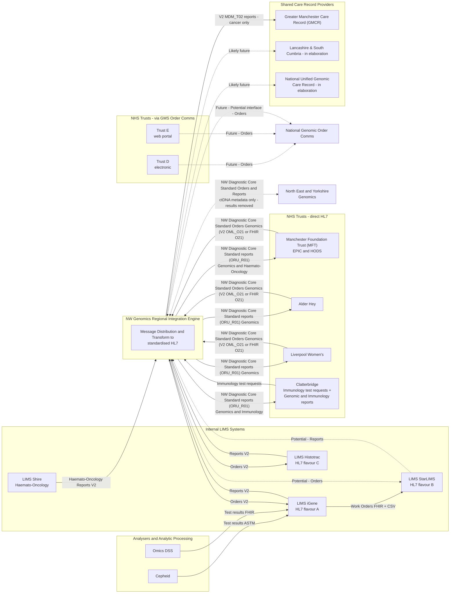
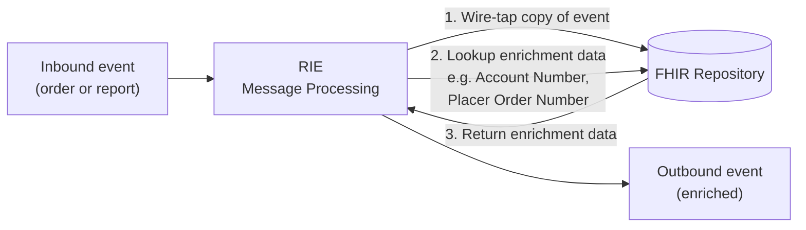
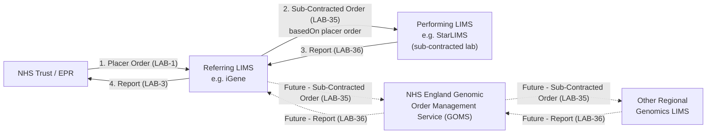
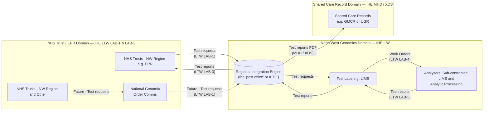
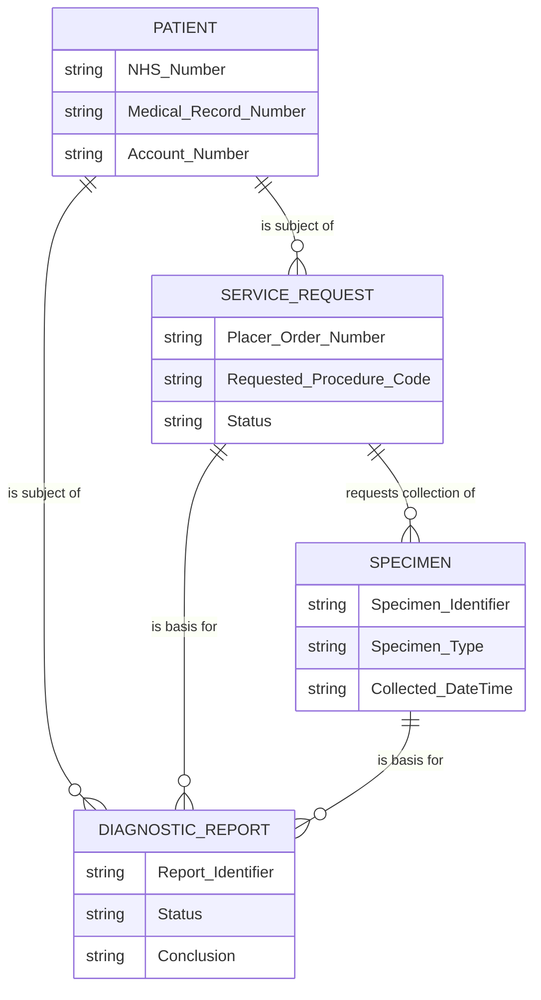
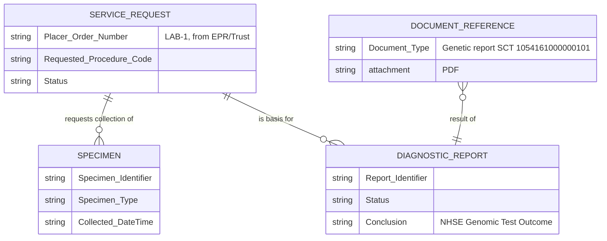
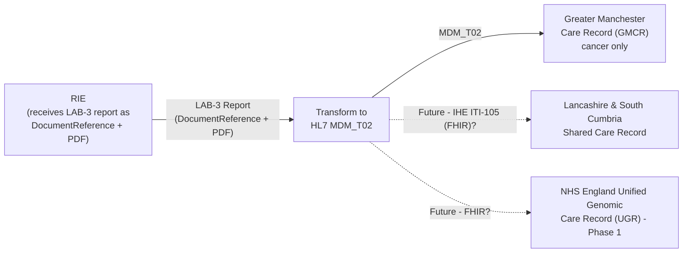
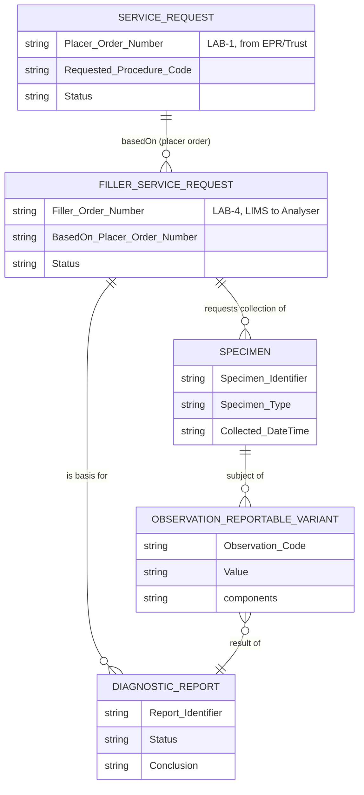
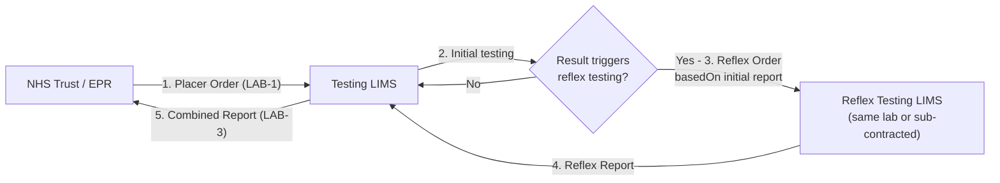

This is currently being elaborated and subject to change.

NW Genomics Regional Integration Engine (RIE).

<strong>Glossary of terms used on this page</strong>

- **IHE** — Integrating the Healthcare Enterprise: an international framework for how healthcare IT systems should exchange information.
- **LTW** — IHE Laboratory Testing Workflow: the IHE profile covering how test orders and reports flow between a hospital's EPR and a lab.
- **ILW** — IHE Inter Laboratory Workflow: the IHE profile covering how one lab refers or forwards work to another lab or analyser.
- **MHD / XDS** — IHE profiles for sharing documents (such as PDF reports) across organisations, e.g. into a shared care record.
- **TIE** — Trust Integration Engine: the local system inside an NHS Trust or lab that translates messages into and out of its own IT systems.
- **LIMS** — Laboratory Information Management System: the software a test lab uses to manage samples and results.
- **EPR** — Electronic Patient Record: a hospital's main clinical IT system.
- **HL7 v2 / FHIR** — the two families of data standard used to exchange healthcare information electronically. HL7 v2 is the older, message-based standard; FHIR is the newer, more flexible standard.
- **ORU_R01** — an HL7 v2 message type for delivering a test result/report.
- **OML_O21** — an HL7 v2 message type for placing a laboratory order.
- **MDM_T02** — an HL7 v2 message type for sending a document (e.g. a PDF report) into a record system.

## References

1. [Diagnostic Core](diagnostic-core.html)
2. [HL7 Genomics Reporting IG](https://build.fhir.org/ig/HL7/genomics-reporting/)
3. [StarLIMS / iGene Integration](starLIMS.html)
4. [Canonical Data Model](https://www.enterpriseintegrationpatterns.com/patterns/messaging/CanonicalDataModel.html) pattern
5. [Data Contract](https://en.wikipedia.org/wiki/Data_contract)
6. [Bounded Context](https://martinfowler.com/bliki/BoundedContext.html)

## Actors

| IHE Actor                                                                | Role                                                            |
|-------------------------------------------------------------------------------|-------------------------------------------------------------------|
| [Order Filler](ActorDefinition-OrderFiller.html)                                 | LIMS iGene - internal LIMS, master LIMS                             |
| [Subcontractor](ActorDefinition-Subcontractor.html) (ILW)                        | LIMS StarLIMS - internal LIMS, Liverpool GLH satellite LIMS         |
| [Order Filler](ActorDefinition-OrderFiller.html)                                 | LIMS Histotrac - internal LIMS, Histocompatibility and Immunogenetics |
| [Order Filler](ActorDefinition-OrderFiller.html)                                 | LIMS Shire - internal LIMS, Haemato-Oncology                        |
| [Automation Manager](ActorDefinition-AutomationManager.html)                     | Cepheid - analyser, test results via ASTM                            |
| [Automation Manager](ActorDefinition-AutomationManager.html)                     | Omics DSS - analytic processing, test results via FHIR               |
| [Intermediary](ActorDefinition-Intermediary.html)                              | Regional Integration Engine (RIE) - message distribution and transformation hub ("post office") |
| [Order Placer](ActorDefinition-OrderPlacer.html)                                 | Manchester Foundation Trust (MFT) - NHS Trust, direct HL7 (EPIC and HODS) |
| [Order Placer](ActorDefinition-OrderPlacer.html)                                 | Alder Hey - NHS Trust, direct HL7                                    |
| [Order Placer](ActorDefinition-OrderPlacer.html)                                 | Liverpool Women's - NHS Trust, direct HL7                            |
| [Order Placer](ActorDefinition-OrderPlacer.html)                                 | Clatterbridge - NHS Trust, direct HL7 (Immunology test requests + Genomic and Immunology reports) |
| [Order Placer](ActorDefinition-OrderPlacer.html) (via GMS Order Comms)           | NHS Trusts - electronic or web portal, not direct HL7 to the RIE       |
| [Automation Manager](ActorDefinition-AutomationManager.html)                     | National Genomic Order Comms - national ordering system / web portal (future interface, GOMS) |
| [Document Consumer](ActorDefinition-DocumentConsumer.html)                       | Greater Manchester Care Record (GMCR) - Shared Care Record Provider, cancer only |
| [Document Consumer](ActorDefinition-DocumentConsumer.html)                       | Lancashire & South Cumbria - Shared Care Record Provider, in elaboration |
| [Document Consumer](ActorDefinition-DocumentConsumer.html)                       | National Unified Genomic Care Record (UGR) - Shared Care Record Provider, in elaboration |
| [Requestor](ActorDefinition-Requestor.html) / [Subcontractor](ActorDefinition-Subcontractor.html) (ILW, peer exchange) | North East and Yorkshire (NE&Y) Genomics - peer Genomic Laboratory Hub, ctDNA metadata only, results removed |
{:.grid}

## Transactions

| Transaction                                          | Description                                                  |
|-----------------------------------------------------------|---------------------------------------------------------------|
| `ORU_R01`                                                   | Test report/result delivery                                     |
| `OML_O21` / FHIR `O21`                                      | Laboratory order placement                                       |
| `MDM_T02`                                                   | Document delivery (e.g. PDF report) to a shared care record       |
| NW Diagnostic Core Standard Orders and Reports (ctDNA metadata only, results removed) | Peer exchange with NE&Y Genomics |
{:.grid}

## Current Process

Think of the Regional Integration Engine (RIE) as a **post office for genomic test information** across North West Genomics.

- **Test labs** (the LIMS systems that process genomic tests) send their results to the RIE.
- The RIE **translates and sorts** these results into a standard format.
- The RIE **delivers** results to NHS Trusts in the North West region, and also shares them (as PDF documents) with shared care record systems, like the Greater Manchester Care Record, so a patient's wider care team can see them.

Test requests work the same way in reverse: an NHS Trust orders a test, the RIE passes it to the right lab in the format that lab needs. North West Trusts can send requests directly to the RIE, while Trusts from the North West and elsewhere can also order through a national ordering system / web portal.

### Simplified diagram

### Why this is different from a typical integration

Most NHS integrations connect an EPR directly to a LIMS, one pair at a time. The RIE works differently.

By sitting in the middle, the RIE hides the different HL7 LIMS variants used internally by North West Genomics and provides a single, consistent interface — this makes it much simpler for NHS Trusts to interoperate. The reverse is also true: North West Genomics doesn't need to work with multiple HL7 EPR standards from each Trust, since a single standard HL7 format is used instead.

Transformation to each Trust's EPR and each lab's LIMS still has to happen — but it's done by TIE (Trust Integration Engine) developers who are already familiar with those standards, for example NHS Trust developers for EPR HL7, and North West Genomics developers for LIMS.

This use of HL7/FHIR standards is also called a "Canonical Model" or "Data Contracts". It is neither an EPR standard nor a LIMS standard — it is a standard agreed between NHS Trusts and Diagnostics Services.

> **The sections below (Technical detail, Design, Data model) are written for architects and technical readers. If you just needed the summary, you can stop here.**

### Technical detail

The NW Genomics Regional Integration Engine (RIE) acts as a central messaging hub — effectively a "post office" — for North West Genomics.

The RIE handles message distribution and transformation to standardised HL7, distributing orders and reports to NHS Trusts. It has the potential to interface with national order comms systems, including the one currently in development by the NHS Genomic Medicine Service, for receiving standardised orders.

A second group of NHS Trusts create orders via the NHS Genomic Medicine Service Order Comms system, either electronically or through its web portal, rather than sending standardised HL7 orders directly to the RIE.

The RIE connects to multiple internal LIMS systems — including iGene, StarLIMS, and others — each using its own variant of HL7 messaging. It transforms these into standardised report messages for consumption by NHS Trusts. In the reverse direction, standardised orders received from NHS Trusts (or potentially national order comms) are transformed by the RIE into the appropriate HL7 flavour for each destination LIMS.

Reports are also sent to shared care record providers using HL7 MDM_T02 (the HL7 v2 message type for sending a document, such as a PDF report), currently for the Greater Manchester Care Record (GMCR) — this feed is cancer only. Similar services are likely to be provided to Lancashire and South Cumbria, and to the national Unified Genomic Care Record.

The RIE also exchanges NW Diagnostic Core Standard orders and reports with North East and Yorkshire Genomics, as a peer Genomic Laboratory Hub — ctDNA metadata only, with results removed.

> **Note:** Test Results and Work Orders also flow via the RIE, this is not shown in the diagram to aid clarity.

#### Technical diagram

The diagram below labels each flow with its HL7 v2 message type: `ORU_R01` delivers a result/report, `OML_O21` places a laboratory order, and `MDM_T02` sends a document such as a PDF report.

#### FHIR Repository

The RIE using a wire-tap, populates a FHIR repository from the events passing through it. This FHIR Repository is also used to enhance events passing through the RIE, such as adding an account number or order placer number to a report.

## Future Process

The RIE is also capable of interfacing to National Genomic Order Comms systems. This will allow users to create genomic orders via a portal or via 3rd party apps.

Potentially the RIE will be able to make use of this system for out of region orders, both incoming and outgoing.

Note: the RIE already has FHIR to V2 conversion capabilities which could be used to send reports to NHS Trusts, which may be a cost saving for NHS Trusts.

North West Genomics is moving towards all orders being placed in the master LIMS (iGene) and then passed onto other LIMS such as StarLIMS, which was the master LIMS for Liverpool GLH.
The implication of this is that orders for other regional Genomics services will initially be placed in iGene, and will then be passed onto other LIMS. Logically this is a potential role for the NHS England Genomic Order Management System (GOMS), acting as an Order Comms system for NHS Trusts.

### Future Composition / Aggregated Laboratory Report

This is a placeholder for future work, probably NHS England Unified Genomics Care Record phase II.

In Domain Driven Design this is a pattern called Aggregate, which collates multiple events into a single entity. This is already a feature of the design above, the placer order cascades into multiple hierarchical entities.

In health informatics this is a pattern called Composition; it focuses on the output format, which in FHIR is called a FHIR Document (and in HL7 v3 Clinical Document Architecture).

## Data Models

The design generally follows Domain Driven Design principles, plus related data engineering principles such as Data Mesh and Data Contracts. The domain split follows IHE profiles as follows:

- Interactions between NHS Trusts/EPR and North West Genomics follow IHE Laboratory Testing Workflow (LTW) interactions LAB-1 (placing an order) and LAB-3 (returning a report).
- Interactions between LIMS follow IHE Inter Laboratory Workflow (ILW).
- Interactions between NW Genomics and shared care record providers currently follow IHE Mobile Access to Health Documents (MHD) — the older version of this profile is known as Cross Enterprise Document Sharing (XDS).
- Interactions between LIMS and Analysers follow IHE Laboratory Testing Workflow (LTW) interactions LAB-4 (a lab ordering further analysis internally) and LAB-5 (the analyser returning its results).

### Diagnostic Core

The data models used in these interactions follow a core canonical model ([nw-gmsa.github.io/en/diagnostic-core.html](https://nw-gmsa.github.io/en/diagnostic-core.html)) which is documented as a series of HL7 FHIR profiles and can be implemented in HL7 v2, ASTM, FHIR and other formats.

Although unsolicited reports are supported, the default design is built around multiple closed loop referrals. This is particularly dependent on a number of identifiers and codes, including:

- **Account Number** (known in the NHS England Data Dictionary as Hospital Spell Identifier) — links multiple diagnostic referrals with an NHS Trust's Episodes/Spells.
- **Placer Order Number** — links specific referrals between an NHS Trust and a LIMS.
- **NHS Number**
- **Medical Record Number** (also known as Hospital Number or NHS England Local Patient Identifier)
- **Requested Procedure Code** — the Genomics Test Directory Code.

In everyday terms: a patient has a referral (Service Request), which leads to a specimen being collected and a report being produced.

Codes tend to follow the NHS England Data Dictionary and include ODS and SNOMED CT concepts. LOINC is also used where it is more practical to do so — codes often don't exist in SNOMED CT, and LOINC is more widely supported by LIMS and EPR systems.

> The NW Diagnostic Core tends to be used between [bounded contexts](https://martinfowler.com/bliki/BoundedContext.html) which are generally between NHS Trusts, ICS/Regions and North West Genomics.
>
> In Data Engineering terms, this is also known as a [Data Contract](https://en.wikipedia.org/wiki/Data_contract).
>
> The main aim for both is to reduce the need for 'anti-corruption layers' which often exist in HL7 v2 and (UK) FHIR to transform between different models used by EPRs.
>
> This should not be confused with UK Core which is a base HL7 standard.

### Genomic Model - Placer Order (LAB-1) and Reports (LAB-3)

The genomic-specific data model builds on the Diagnostic Core (the main model used for interactions IHE LTW LAB-1 and LAB-3), which is very similar to de-facto models used in other diagnostic services such as imaging or pathology.
At present this model is mostly unstructured, using a PDF attachment (in FHIR this is DocumentReference + Binary, and in HL7 v2 this is OBX type ED).

In everyday terms: the same referral and specimen as above, but the report is attached as a document (e.g. a PDF) rather than as structured data.

##### Shared Care Record Feeds - Wire tap on LAB-3/ORU_R01

> **Note:** The DocumentReference + attachment currently forms the basis for interactions with shared care record providers (i.e. this is what is used to generate MDM_T02 for GMCR).

The same LAB-3 report is also the source for the MDM_T02 feed sent to shared care record providers, currently GMCR, with Lancashire & South Cumbria and the NHS England Unified Genomic Care Record (UGR) Phase 1 planned as future recipients of the same feed. See [ctDNA NHS England Unified Genomic Record (UGR)](ctDNAUGR.html) for the two planned UGR phases in detail.

### Genomic Model - Filler Order (LAB-4) and Reports (LAB-5)

The interactions between the LIMS and Analysers/Analytic Processors (LAB-4 and LAB-5) add detailed genomic data models. These are referred to here as filler orders, with the simpler LAB-1 and LAB-3 referred to as placer orders.

These filler orders add Observations (results from DiagnosticReport). For Omics DSS these observations are known as Reportable Variant, following [build.fhir.org/ig/HL7/genomics-reporting](https://build.fhir.org/ig/HL7/genomics-reporting/).

In everyday terms: this adds the internal lab-to-analyser order (Filler Service Request) and the individual result values (Observations, e.g. a specific variant found) that sit behind the report.

### Sub-Contracted and Reflex Orders (LAB-35) and Reports (LAB-36)

In most cases, a sub-contracted order will be very similar to a placer order. This is where an order has been received and is then passed on to a sub-contracted lab.

In everyday terms: the referring lab (e.g. iGene) creates its own order based on the original placer order, and sends it to the performing lab (e.g. StarLIMS), which returns a report against that same order.

#### Reflex Order

A reflex order is a different kind of sub-contracted order: rather than forwarding on the original placer order unchanged, a laboratory raises a brand new order that is **triggered by the result of its own testing** — for example, a positive screening result that automatically triggers a confirmatory or additional test.

The key difference from a standard sub-contracted order (LAB-35/LAB-36) is what the new order is basedOn: a sub-contracted order is basedOn the original placer order, whereas a reflex order is basedOn the Diagnostic Report/Observation that triggered it. The reflex test itself may be performed in the same lab or passed on to another lab as a further sub-contracted order.

In everyday terms: the lab tests a sample, sees a result that needs following up, and — without waiting for the referrer to ask — places its own new order for further testing, quoting the original report as the reason.

## Examples

FHIR examples for the Laboratory Order (LAB-1) and Laboratory Report (LAB-3) interactions described above:

- [Example: Laboratory Order](artifacts.html#example-laboratory-order) - LAB-1 examples in FHIR format
- [Example: Laboratory Report](artifacts.html#example-laboratory-report) - LAB-3 examples in FHIR format

## Developer Guides

- [02 - Work Orders: A Worked Example](https://github.com/nw-gmsa/Testing/blob/main/notebooks/02-work-orders-worked-example.ipynb) - finding a laboratory's current work orders (`Task`-based filtering) for Liverpool GLH (ODS `K1S6S`), one of the regional LIMS the RIE integrates
- [03 - Orders: Building a FHIR Order Message from a CSV](https://github.com/nw-gmsa/Testing/blob/main/notebooks/03-laboratory-order-from-csv.ipynb) - builds a laboratory-order `Bundle` from a row of `Input/NEYctDNA.csv`, following the `laboratory-order` `MessageDefinition`
- [04 - Reports: HL7 v2 `ORU^R01` into FHIR](https://github.com/nw-gmsa/Testing/blob/main/notebooks/04-laboratory-report-fhir-from-hl7v2.ipynb) - converts a lab's own HL7 v2 report into a FHIR `R01` Message, and on to the `MDM_T02` document feed sent to shared care record providers
- [06 - EU Laboratory Report: FHIR Messages to a FHIR Document](https://github.com/nw-gmsa/Testing/blob/main/notebooks/06-eu-laboratory-report-fhir-document.ipynb) - builds a FHIR Document (`Composition`-led `Bundle`) from the same ctDNA source data as 04/05, the shape NHS England's Unified Genomic Record (UGR) Phase 2 expects
- [07 - FHIR Repository: RESTful Events and Aggregates](https://github.com/nw-gmsa/Testing/blob/main/notebooks/07-fhir-repository-events-and-aggregates.ipynb) - RESTful `GET`/`batch`/`transaction` access against the FHIR Repository the RIE populates via wire-tap
- [09 - LIMS Integration with the Genomic Order Management Service](https://github.com/nw-gmsa/Testing/blob/main/notebooks/09-genomic-order-management-fhir-to-hl7v2-for-lims.ipynb) - converts a FHIR order from NHS England's Genomic Order Management Service (GOMS) API into the HL7 v2 this region's LIMS expects
- [10 - Histocompatibility and Immunogenetics: HL7 v2 to and from the NW Standard](https://github.com/nw-gmsa/Testing/blob/main/notebooks/10-histocompatibility-immunogenetics-hl7v2-nw-standard.ipynb) - hand-builds the field-level conversion a Trust Integration Engine (TIE) does between its own Trust's local HL7 v2 flavour and the shared [NW HL7 v2 standard](hl7v2.html) - a conversion common to LAB-1 and LAB-3 across all Trust Integration Engines, not just the Histocompatibility worked example used here

See [Developer Guides](DeveloperGuides.html) for the full notebook series.
