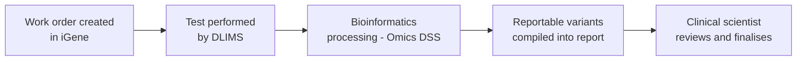
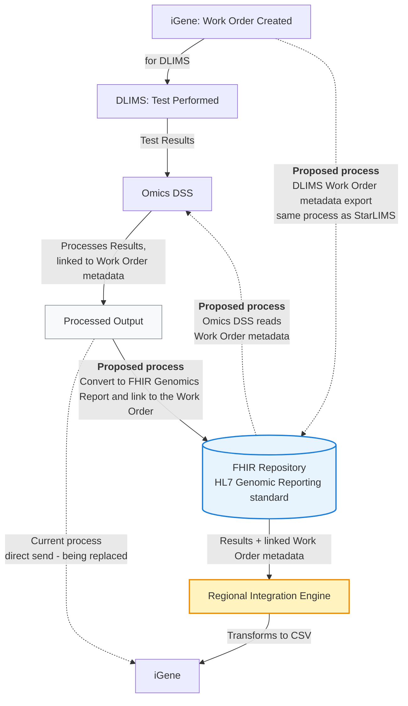
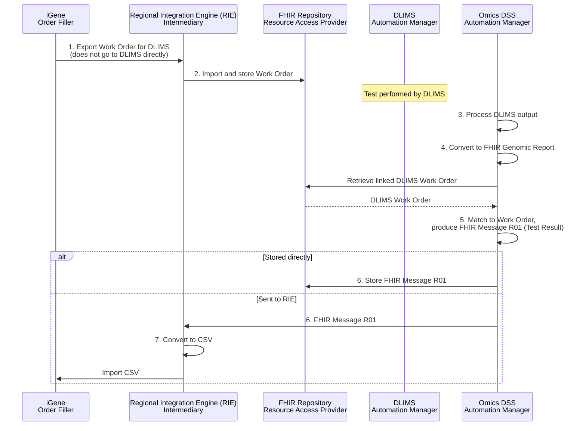

This is currently being elaborated and subject to change.

DSS and iGene Integration Overview.

## References

1. [HL7 Genomic Reporting standard](https://build.fhir.org/ig/HL7/genomics-reporting/)
2. [StarLIMS / iGene Integration](starLIMS.html) - the work order metadata export pattern this mirrors
3. [HL7 Lab Results Interface (LRI), Release 1 from May 2017](https://confluence.hl7.org/download/attachments/25559919/2018%2004%2003%20-%20V2%20LRI%20-%20Ch.%205%20CG%20and%20Code%20System%20Tables.pdf?api=v2) - source for the NTHL1 and CFTR variant examples the [Result Panel](#result-panel) below is partly built from
4. `iGene Custom Fields Master Dataset - Updated 13-Aug-26.xlsx`, "Variant Level Data" sheet (internal iGene specification document, not publicly linked) - the original iGene field spec and LOINC crosswalk the [Result Panel](#result-panel) below is otherwise built from

## Clinical Pathway Overview

### What is being tested

This use case isn't a specific clinical test in its own right - it's the pipeline
that turns a genomic laboratory's raw molecular testing output (from a satellite
LIMS, "DLIMS") into the structured, reportable genomic variants used in a patient's
genomic report. Any DLIMS-processed molecular/NGS test - for example a cancer or
rare disease gene panel - uses this same pattern.

### The end-to-end clinical journey

1. **Work order created** - iGene generates a work order for a specific molecular test as part of processing a patient's sample.
2. **Test performed** - DLIMS carries out the test against the work order.
3. **Bioinformatics processing** - Omics DSS processes the DLIMS output into discrete, reportable variants, linked back to the originating work order.
4. **Report compiled** - iGene incorporates the reportable variants into the patient's genomic report.
5. **Clinical decision** - the reporting clinical scientist/clinician reviews the reportable variants to interpret and finalise the report for the referring clinician.

### Why this matters for developers

- Reportable variants follow the [HL7 Genomics Reporting IG](https://build.fhir.org/ig/HL7/genomics-reporting/)'s discrete `Observation` pattern - not a single free-text result - see [Variant (Reportable Variant)](StructureDefinition-Variant.html).
- The FHIR Repository is the intermediate handoff point between Omics DSS and iGene - Omics DSS doesn't write results back to iGene directly, see [Future Process](#future-process) below.

## Actors

| IHE Actor                                                                | Role                                                    |
|-------------------------------------------------------------------------------|----------------------------------------------------------|
| [Order Filler](ActorDefinition-OrderFiller.html)                                 | iGene - master LIMS, creates the work order, ultimate destination for processed results |
| [Automation Manager](ActorDefinition-AutomationManager.html)                     | DLIMS - satellite LIMS, performs the test against the work order  |
| [Automation Manager](ActorDefinition-AutomationManager.html)                     | Omics DSS - processes DLIMS test results, linked to work order metadata |
| [Resource Access Provider](ActorDefinition-ResourceAccessProvider.html)          | FHIR Repository - stores the work order and the resulting FHIR Genomics Report |
| [Intermediary](ActorDefinition-Intermediary.html)                              | Regional Integration Engine (RIE) - transforms the FHIR Genomics Report into iGene's CSV format |
{:.grid}

## Transactions

| Transaction                                | Description                                             | Direction                          |
|-----------------------------------------------|----------------------------------------------------------|---------------------------------------|
| `LAB-4`                                          | Work order created for DLIMS                                | iGene → DLIMS                          |
| `LAB-5` (current, being replaced)                | DLIMS test results sent for processing, then processed output sent directly to iGene | DLIMS → Omics DSS → iGene |
| FHIR RESTful create (proposed)                   | Work Order metadata export, mirrors the StarLIMS export pattern | iGene → FHIR Repository                |
| FHIR RESTful read (proposed)                     | Work Order metadata read, so results can be linked back to the originating work order | Omics DSS → FHIR Repository |
| `LAB-5` / FHIR RESTful create (proposed)         | Processed output converted to a FHIR Genomics Report and linked to the Work Order | Omics DSS → FHIR Repository |
| CSV transform (proposed)                         | Results + linked Work Order metadata transformed for iGene  | FHIR Repository → RIE → iGene          |
{:.grid}

## Current Process

The current process works as follows:

1. A work order is created in iGene (for DLIMS)
2. Once the test in DLIMS is complete, the results are sent to Omics DSS
3. Omics DSS processes the results
4. The processed output is sent to iGene

## Future Process

Rather than sending processed output directly to iGene, it will instead be converted to a FHIR Genomics Report and stored in the FHIR Repository, following the HL7 Genomic Reporting standard. The Regional Integration Engine will then transform this data into a format suitable for iGene (likely a CSV file).

For this to work, the DLIMS work order will be exported to the FHIR Repository — mirroring the process already used for StarLIMS — so a copy of the work order is held there. Omics DSS will then access the work order metadata via the FHIR Repository, so results can be correctly linked back to the originating work order.

### Detailed Process Flow

1. iGene exports work orders for DLIMS - this export does not go to DLIMS directly.
2. The RIE imports the file and stores it in the FHIR Repository.
3. Once the results have been produced by DLIMS, Omics DSS processes the output.
4. This output is converted to a FHIR Genomic Report.
5. These resources are matched with the DLIMS work order stored in the FHIR Repository, and a FHIR Message R01 (Test Result) is produced.
6. This is either stored directly in the FHIR Repository, or sent to the Regional Integration Engine.
7. The RIE will then convert this into a CSV file to be imported into iGene LIMS.

## Data Models

- [ServiceRequest (Work Order)](StructureDefinition-ServiceRequest.html) - the DLIMS work order exported to the FHIR Repository
- [DiagnosticReport](StructureDefinition-DiagnosticReport.html) - the FHIR Genomics Report Omics DSS produces
- [Variant (Reportable Variant)](StructureDefinition-Variant.html) - the discrete result Observations, following the [HL7 Genomics Reporting IG](https://build.fhir.org/ig/HL7/genomics-reporting/)
- [Molecular Consequence](StructureDefinition-MolecularConsequence.html) - a separate `derivedFrom` Observation for a variant's downstream effect, including Loss of Heterozygosity - see [Outstanding Issues](#outstanding-issues) below

### Work Order CSV from iGene

<b>FHIR Questionnaire:</b> <a href="Questionnaire-StarLIMSSampleDataExport.html">StarLIMS Sample Data Export (iGene CSV)</a>

The proposed DLIMS work order metadata export (see [Future Process](#future-process)
above, "mirroring the process already used for StarLIMS") is expected to reuse the same
CSV shape as iGene's existing StarLIMS work order export - see [StarLIMS / iGene
Integration - Work Order CSV Export from iGene](starLIMS.html#work-order-csv-export-from-igene)
for the full column-by-column description and FHIR mapping table, and
[StarLIMSSampleData.csv](https://github.com/nw-gmsa/Testing/blob/main/Input/StarLIMSSampleData.csv)
for an example file. Not duplicated here to avoid the two tables drifting apart -
DLIMS/Omics DSS work orders carry the same underlying order/patient/specimen data as a
StarLIMS work order, just a different downstream processor.

### Test Result 

#### iGene Variant Types

iGene's own custom field spec (see [References](#references)) splits reportable
variants into five types, each with its own repeating set of custom fields -
`SEQV1`-`SEQV10` (Sequence Variant), `ICNV1`-`ICNV3` (Intragenic Copy Number
Variant), `MCNV1`-`MCNV3` (Multigenic Copy Number Variant), `SV1`-`SV3` (Structural
Variant) and `LOH1`-`LOH2` (Loss of Heterozygosity). These are different *kinds* of
genomic change that can all appear on the same report - not different tests - which
is why iGene buckets them into separate repeating slots rather than one flat list.

- **Sequence Variant (SEQV)** - a small change at a specific point in a gene:
  substitution, insertion, deletion, indel. Anchored to a transcript, e.g. `BRCA1
  c.68_69del` - the "classic point mutation."
- **Intragenic CNV (ICNV)** - a copy-number change (usually a loss) still contained
  *within one gene* - e.g. deletion of exons 13-15 of `FBN1`. Still gene/transcript-
  anchored (its Description field combines transcript+gene+HGVS, the same shape as
  SEQV), but describes exon-level gain/loss rather than a single base change.
- **Multigenic CNV (MCNV)** - a copy-number change spanning a *larger region covering
  multiple genes* or a chromosome band, e.g. loss of `Xq22.1-q28`. No longer anchored
  to one gene, so its Description field is just the cytogenetic location, not a
  transcript+HGVS string.
- **Structural Variant (SV)** - large-scale rearrangements (translocations,
  inversions, complex events) that aren't necessarily a simple copy-number gain/loss
  - could be balanced. iGene gives it only one free-text HGVS-style field and drops
  the Inheritance field entirely (parent-of-origin isn't typically assessed for
  these).
- **Loss of Heterozygosity (LOH)** - not really a "variant" in the same sense at all:
  it's a *state* where one parental copy of a region is lost or indistinguishable
  from the other, often reported in cancer alongside a point mutation on the other
  allele (a classic "two-hit" tumour-suppressor finding). That's why it's the odd one
  out with only 2 fields (Gene(s), and a yes/no-ish LOH flag) rather than the usual 7
  - and why this IG models it as a separate [Molecular
  Consequence](StructureDefinition-MolecularConsequence.html) Observation,
  `derivedFrom` the variant it accompanies, rather than folding it into `Variant`
  itself - see [Outstanding Issues](#outstanding-issues) below.

**How they interrelate:**

- They are **not mutually exclusive** - a single report commonly carries findings
  from more than one type at once (e.g. one SEQV plus LOH at the same locus).
- They form a rough **scale of scope**: SEQV (single base/small indel) → ICNV (whole
  gene, exon-level) → MCNV (multiple genes/chromosome band) → SV (large
  rearrangement, not necessarily copy-number). LOH sits outside that scale entirely.
- They share the **same 7-field shape** (Description/State/Inheritance/Level/
  Genomic_coordinates/Classification/Evidence) because iGene applies one generic
  reporting workflow to all of them - what narrows as scope widens is what goes
  *into* the Description field.
- Crucially, **neither LRI nor the international FHIR Variant profile treats these as
  five separate things at all** - they are all just the same single Discrete Variant
  Panel/Observation, distinguished only by *which components happen to be
  populated* (an SV row has ref/alt allele and DNA change type but no allelic state;
  an MCNV row has cytogenetic location but no gene). iGene is the only place that
  formally splits them into five field-groups - the tension this raises with LRI/FHIR
  is captured in [Outstanding Issues](#outstanding-issues) below. LOH is the sharpest
  case, since it has no home in either standard at all.

#### Result Panel

<b>FHIR Questionnaire (Result Panel):</b> <a href="Questionnaire-ReportableVariantResultPanel.html">Reportable Variant Result Panel</a>

The [HL7 LRI](#references) already defines a single **Discrete Variant Panel**
(LOINC `81250-3`, LRI Chapter 5 Table 5-2, plus the Structural Variant Addenda in
Table 5-3) covering both simple and structural variants - the same panel the NTHL1
and CFTR examples are based on. Rather than iGene's separate per-variant-type field
sets, the Result Panel Questionnaire is structured around this one LRI panel, with
each item mapped to its LRI `OBX` row, its component in the HL7 Genomics Reporting
IG's [Variant](https://build.fhir.org/ig/HL7/genomics-reporting/StructureDefinition-variant.html)
profile, and the iGene field it rolls up into. Only elements genuinely populated by
at least one current example are modelled - see [Result Panel: Elements Not
Included](#result-panel-elements-not-included) below for the rest.

All example values below are taken from a single variant - the small-variant
Observation (`ctdna9737383222-seqv1`, a `BRCA1` deletion) in
[Bundle-ctdna9737383222-testresults](Bundle-ctdna9737383222-testresults.html) - so
they show one coherent, real result rather than a patchwork from different examples.
Rows marked N/A are structural/CNV-specific and don't apply to this simple variant;
see the [mapping table's own examples](Bundle-ctdna9737383222-testresults.html) for
the intragenic-CNV, multi-gene-CNV and structural-variant Observations in the same
Bundle if a worked CNV/SV example is needed.

| LRI Row | LOINC                                     | HL7 v2 OBX (Type, R/O/C, Card.) | FHIR Variant Component | iGene Field                        | Example                          |
|---------|--------------------------------------------|----------------------------------|--------------------------|--------------------------------------|-----------------------------------|
| B.1     | 83005-9 Variant category                   | CWE, O, [0..1]                    | *(open-slice - LRI's own answer list only distinguishes Simple/Structural; this IG binds it to [IGeneVariantCategory](CodeSystem-IGeneVariantCategory.html) instead)* | *(is)* the iGene slot type | `SEQV` |
| B.3     | 48018-6 Gene studied [ID]                  | CWE, C, [0..1]                    | `gene-studied` *(this IG's own addition)* | Description (SEQV/ICNV), Gene(s) (LOH) | `BRCA1`                    |
| B.4     | 51958-7 Transcript reference sequence [ID] | CWE, C, [0..1]                    | `representative-transcript-ref-seq` | Description (SEQV/ICNV)              | `NM_007294.3`                     |
| B.5     | 48004-6 DNA change (c.HGVS)                | CWE, C, [0..1]                    | `representative-coding-hgvs` | Description (SEQV/ICNV)              | `c.68_69del`                      |
| B.6     | 48005-3 Amino acid change (pHGVS)          | CWE, C, [0..1]                    | `representative-protein-hgvs` | Description (SEQV only)              | `p.(Glu23ValfsTer17)`             |
| B.7     | 48019-4 DNA change [Type]                  | CWE, O, [0..1]                    | `coding-change-type`     | *(not discrete - within Description/Genomic_coordinates)* | `deletion`                        |
| B.9     | 48013-7 Genomic reference sequence [ID]    | CWE, C, [0..1]                    | `genomic-ref-seq`        | Genomic_coordinates (all)             | `NC_000017.10`                    |
| B.10    | 81290-9 Genomic DNA change (gHGVS)         | CWE, C, [0..1]                    | `genomic-hgvs`           | Genomic_coordinates (all)             | `g.41276047_41276048del`          |
| B.11    | 69547-8 Genomic ref allele [ID]            | ST, C, [0..1]                     | `ref-allele`             | *(not discrete)*                      | `TCT`                             |
| B.12    | 81254-5 Genomic allele start-end           | NR, C, [0..1]                     | `exact-start-end`        | *(not discrete)*                      | `41276046` (low bound only)       |
| B.13    | 69551-0 Genomic alt allele [ID]            | ST, C, [0..1]                     | `alt-allele`             | *(not discrete)*                      | `T`                                |
| B.17    | 48001-2 Cytogenetic (chromosome) location  | CWE, O, [0..1]                    | *(open-slice - see note below; not the profile's Cytogenomic Nomenclature slice)* | Description (MCNV), Genomic_coordinates (others) | N/A - CNV-specific |
| B.18    | 48002-0 Genomic source class [Type]        | CNE, R, [0..*]                    | `genomic-source-class`   | *(not discrete)*                      | `Germline`                        |
| B.20    | 53037-8 Genetic variation clinical significance [Imp] | CNE, O, [0..1]        | *(not a named slice - open-slice, matches every example)* | Classification (all)                  | `Pathogenic`                      |
| B.23    | 53034-5 Allelic state                      | CNE, C, [0..1]                    | `allelic-state`          | State/Zygosity/Copy-number state (all except LOH) | `Heterozygous`             |
| B.24    | 81258-6 Allelic Frequency [NFr]            | NM, C, [0..1]                     | `sample-allelic-frequency` | Level/VAF % (all except LOH)         | `0.33`                             |
| B.28 *(Table 5-3)* | 82155-3 Genomic structural variant copy number | NM, O, [0..1], sub-ID 2a.1 | `copy-number`      | *(not discrete)*                      | N/A - CNV-specific                 |
| B.32 *(Table 5-3)* | 81302-2 Structural variant inner start and end | NR, O, [0..1], sub-ID 2a.1 | `inner-start-end`  | *(not discrete)*                      | N/A - CNV/SV-specific              |
{:.grid}

Three gaps are not yet resolved:

- **Loss of Heterozygosity** is one of iGene's five variant types, but has **no
  corresponding row anywhere in LRI's Discrete Variant Panel** - LRI's closest
  concept, Allelic State (B.23), has no LOH answer option. No current FHIR example
  produces LOH data either.
- **Coordinate System [Type] (`92822-6`)** and **Origin of Germline Genetic Variant
  [Type] (`94186-4`)**, both used by the ctDNA Bundle examples (and mapped to the
  FHIR profile's `coordinate-system` and `variant-inheritance` slices respectively),
  have **no row in LRI's Discrete Variant Panel**. LRI's closest concept to the
  latter is Allelic Phase (`82120-7`, row B.26) - a different LOINC code whose answer
  list happens to include Maternal/Paternal among several "set of variants in cis"
  options, not a dedicated parent-of-origin field.
- **Structural Variant**: iGene expects a single `81262-8` "Complex variant HGVS
  name" field (itself an LRI *Complex* Variant Panel code, row C.2 - not part of the
  Discrete Variant Panel at all), but the ctDNA Bundle's structural-variant
  Observation instead uses several Discrete Variant Panel components (B.9, B.11,
  B.13, B.7, B.10) - no example yet confirms how these decompose into, or recombine
  into, `81262-8`.

#### Result Panel: Elements Not Included

LRI's Discrete Variant Panel (Table 5-2/5-3) defines further rows, and the HL7
Genomics Reporting [Variant
profile](https://build.fhir.org/ig/HL7/genomics-reporting/StructureDefinition-variant.html)
defines further component slices, that neither iGene's own field spec nor any
current example populates - these are deliberately left out of the [Result
Panel](#result-panel) above, since they aren't needed for the iGene feed today:

| Data Element                                | LRI Row | LOINC / Code               |
|-----------------------------------------------|---------|-----------------------------|
| Discrete genetic variant [ID] - LRI's own preferred single-field alternative to the fully-decomposed rows above | B.2 | 81252-9 |
| Amino acid change [Type]                      | B.8     | 48006-1                     |
| Haplotype name                                | B.14    | 84414-2                     |
| dbSNP [ID]                                    | B.15    | 81255-2                     |
| CIGAR [ID]                                    | B.16    | 81257-8                     |
| Variant analysis method [Type]                | B.19    | 81304-8                     |
| Genetic variant Assessment                    | B.21    | 69548-6                     |
| Probable Associated Phenotype                 | B.22    | 81259-4                     |
| Allelic read depth                            | B.25    | 82121-5                     |
| Allelic phase                                 | B.26    | 82120-7                     |
| Basis for allelic phase [Type]                | B.27    | 82309-6                     |
| Genomic structural variant reported arrCGH [Ratio] | B.29 *(Table 5-3)* | 81299-0        |
| Structural variant [Length]                   | B.30 *(Table 5-3)* | 81300-6            |
| Structural variant outer start and end        | B.31 *(Table 5-3)* | 81301-4            |
| Cytogenomic Nomenclature (ISCN) - LRI Table 5-1 row A.11 (report-level Master Panel, not the Discrete Variant Panel) | - | 81291-7 |
| Protein Reference Sequence *(FHIR profile only, no LRI row)* | -       | `protein-ref-seq` (local TBD codesystem) |
| Variation Code *(FHIR profile only, no LRI row)* | -      | 81252-9 (same code as B.2, different FHIR slice name) |
| Evidential Basis for Variant Inheritance *(FHIR profile only, no LRI row)* | - | 82309-6 (same code as B.27) |
| Variant Confidence Status *(FHIR profile only, no LRI row)* | -      | `variant-confidence-status` (local TBD codesystem) |
| Repeat Motif *(FHIR profile only, no LRI row)* | -       | `repeat-motif` (local TBD codesystem) |
| Repeat Number *(FHIR profile only, no LRI row)* | -      | `repeat-number` (local TBD codesystem) |
| Clinical Conclusion (`conclusion-string`, inherited from [Genomic Observation](StructureDefinition-GenomicObservation.html)) | - | `conclusion-string` (local TBD codesystem) |
{:.grid}

If a future DLIMS/Omics DSS feed starts populating any of these (for example, read
depth or a repeat-expansion result), or iGene's own spec adds a discrete field for
one, the corresponding item should move up into the [Result Panel](#result-panel)
above, following the same "only what is currently used" rule.

#### Mapping to the iGene CSV

The Result Panel above describes the *discrete variant* shape on the FHIR side - one
`Observation` per variant, repeated as many times as needed. iGene's own import is
expected to be a **flat CSV file**, not a repeating FHIR-style structure: iGene's
"Variant Level Data" spec names each field with a fixed slot prefix (`SEQV1_`...
`SEQV10_`, `ICNV1_`...`ICNV3_`, `MCNV1_`...`MCNV3_`, `SV1_`...`SV3_`, `LOH1_`,
`LOH2_`), which reads as one row per report/order with up to 21 variants' worth of
columns (10 + 3 + 3 + 3 + 2), rather than one row per variant.

Converting the Result Panel's repeating Discrete Variant Panel Observations into that
flat shape means the RIE (or whatever produces the CSV) must, for each `DiagnosticReport`:

1. **Classify** each Variant Observation by type, using the coded `Variant Category`
   component (LRI row B.1, `83005-9`, bound to
   [IGeneVariantCategory](CodeSystem-IGeneVariantCategory.html) - see [Outstanding
   Issues](#outstanding-issues) above) directly into iGene's Sequence Variant /
   Intragenic CNV / Multigenic CNV / Structural Variant bucket. Every current
   `Variant` example now populates this, so classification is an explicit, coded
   value rather than an inference from which other components happen to be
   populated.
2. **Assign a slot number** within that type, in order (first Sequence Variant found
   becomes `SEQV1`, second becomes `SEQV2`, and so on).
3. **Populate that slot's seven flat columns** (`Description`, `State`, `Inheritance`,
   `Level`, `Genomic_coordinates`, `Classification`, `Evidence` - or just `Description`/
   `State` for LOH) from the Result Panel items, per the [mapping table](#result-panel)
   above - for example, `SEQV1_Description` is the concatenation of that variant's
   Transcript Reference Sequence (B.4), Gene Studied (B.3), DNA Change c.HGVS (B.5)
   and Amino Acid Change p.HGVS (B.6).

This raises two open questions, neither resolved by any current example:

- **Slot capacity**: iGene has a fixed maximum per type (10 Sequence Variants, 3 of
  each CNV type, 3 Structural Variants, 2 LOH results). A report with more variants
  of one type than iGene has slots for cannot be fully represented in the CSV as
  currently specified.
- **Slot ordering**: iGene's spec doesn't state what determines slot order (e.g.
  `SEQV1` vs `SEQV2`) when a report has more than one variant of the same type -
  candidates include order of detection, clinical significance, or allelic frequency,
  but none is confirmed.

### Outstanding Issues

1. **Should the `Variant` profile and Result Panel be restructured around iGene's
   own five variant-type categories** (Sequence Variant / Intragenic CNV / Multigenic
   CNV / Structural Variant / Loss of Heterozygosity), rather than the current single
   generic Discrete Variant Panel that mirrors LRI? **Partially decided:** rather than
   a full restructure into five separate profiles/panels (which would diverge from
   both LRI's Discrete Variant Panel and the international HL7 Genomics Reporting
   Variant profile, both of which treat simple and structural variants, and implicitly
   CNVs, as one panel distinguished by which components are populated), this IG adds a
   coded `Variant Category` component (LRI row B.1, LOINC `83005-9`) to `Variant`,
   bound to a new [IGeneVariantCategory](CodeSystem-IGeneVariantCategory.html)
   CodeSystem/value set (`SEQV`/`ICNV`/`MCNV`/`SV`/`LOH`) - an IG-specific extension of
   LRI's own answer list for that row, which only distinguishes Simple Variant vs
   Structural Variant. This makes "which iGene slot type is this" an explicit, coded
   value on the single panel, addressing the [CSV mapping](#mapping-to-the-igene-csv)
   ambiguity above without a structural profile split - see every current `Variant`
   example, which now populates it. See item 2 below for the separate Loss of
   Heterozygosity decision.

2. **Decided: Loss of Heterozygosity is modelled as a separate [Molecular
   Consequence](StructureDefinition-MolecularConsequence.html) Observation**, not as a
   component (or extension) on `Variant` itself. This follows the HL7 Genomics
   Reporting IG's own
   [Molecular Consequence](https://build.fhir.org/ig/HL7/genomics-reporting/StructureDefinition-molecular-consequence.html)
   profile: a `derivedFrom` reference back to the `Variant` it is the consequence of,
   with a `functional-effect` component coded from Sequence Ontology (`SO_0001786`
   `loss_of_heterozygosity`, among other possible values such as loss/gain of
   function) - see [Molecular Consequence - Loss of Heterozygosity
   (BRCA1)](Observation-ctdna9737383222-seqv1-loh.html) for a worked example,
   representing the classic germline-mutation-plus-somatic-LOH "two-hit" finding at
   the same locus as [Variant - ctDNA Small Variant
   (BRCA1)](Observation-ctdna9737383222-seqv1.html). This fits the case where LOH is
   the consequence of an already-reported variant cleanly, but doesn't fit iGene's
   broader usage, which allows LOH to be reported standalone for a gene/region with no
   companion variant required - that gap remains open.

## Examples

| Source                                                                                                                    | Example                                                                                                                       |
|--------------------------------------------------------------------------------------------------------------------------|--------------------------------------------------------------------------------------------------------------------------------|
| GA4GH VCF (input) - see the [VCF v4.3 specification](https://samtools.github.io/hts-specs/VCFv4.3.pdf)                   | [igene_example_data.vcf](https://github.com/nw-gmsa/Testing/blob/main/Input/DSS/VCF/igene_example_data.vcf)                    |
| GA4GH Phenopacket (input) - see the [Phenopacket schema documentation](https://phenopacket-schema.readthedocs.io/en/latest/) | [igene_example_data.phenopacket.json](https://github.com/nw-gmsa/Testing/blob/main/Input/DSS/VCF/igene_example_data.phenopacket.json) |
| FHIR `Bundle` (NW-GMSA `R01` Test Results message) - produced from the VCF/Phenopacket above by notebook [05 - Test Results: GA4GH VCF to FHIR Genomics Reporting](https://github.com/nw-gmsa/Testing/blob/main/notebooks/05-test-results-from-vcf.ipynb) | [Bundle-ctdna9737383222-testresults](Bundle-ctdna9737383222-testresults.html) |
{:.grid}

The four `Variant` Observations inside that Bundle are also extracted as standalone
[Variant](StructureDefinition-Variant.html) examples, for individual reference:

| Variant Type          | Example                                                                        |
|------------------------|----------------------------------------------------------------------------------|
| Sequence (small) variant | [Observation-ctdna9737383222-seqv1](Observation-ctdna9737383222-seqv1.html) (`BRCA1` deletion) |
| Intragenic copy number variant | [Observation-ctdna9737383222-icnv1](Observation-ctdna9737383222-icnv1.html) (`FBN1` exon deletion) |
| Multigenic copy number variant | [Observation-ctdna9737383222-mcnv1](Observation-ctdna9737383222-mcnv1.html) (Xq22.1-q28 deletion) |
| Structural variant     | [Observation-ctdna9737383222-sv1](Observation-ctdna9737383222-sv1.html)          |
| Molecular Consequence - Loss of Heterozygosity | [Observation-ctdna9737383222-seqv1-loh](Observation-ctdna9737383222-seqv1-loh.html) (`derivedFrom` the sequence variant above) |
{:.grid}

## Developer Guides

- [02 - Work Orders: A Worked Example](https://github.com/nw-gmsa/Testing/blob/main/notebooks/02-work-orders-worked-example.ipynb) - retrieving the DLIMS Work Orders from the FHIR Repository, the metadata Omics DSS links its results back to
- [05 - Test Results: GA4GH VCF to FHIR Genomics Reporting](https://github.com/nw-gmsa/Testing/blob/main/notebooks/05-test-results-from-vcf.ipynb) - converts a GA4GH VCF file into discrete `variant` Observations conforming to the HL7 Genomics Reporting IG, plus an NW-GMSA `R01` Test Results message

See [Developer Guides](DeveloperGuides.html) for the full notebook series.
