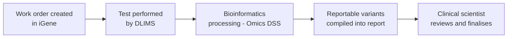
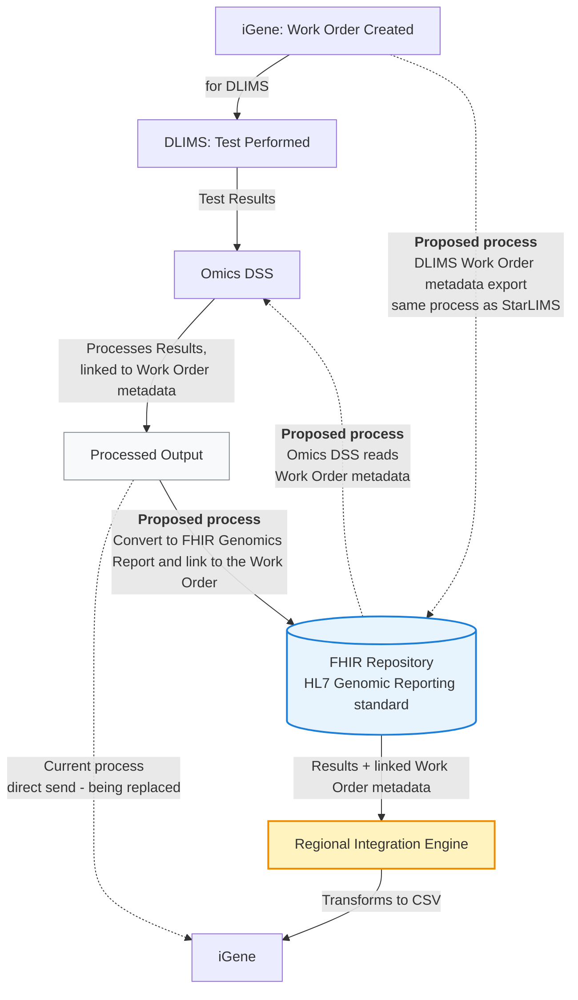

This is currently being elaborated and subject to change.

DSS and iGene Integration Overview.

## References

1. [HL7 Genomic Reporting standard](https://build.fhir.org/ig/HL7/genomics-reporting/)
2. [StarLIMS / iGene Integration](starLIMS.html) - the work order metadata export pattern this mirrors

## Clinical Pathway Overview

### What is being tested

This use case isn't a specific clinical test in its own right - it's the pipeline
that turns a genomic laboratory's raw molecular testing output (from a satellite
LIMS, "DLIMS") into the structured, reportable genomic variants used in a patient's
genomic report. Any DLIMS-processed molecular/NGS test - for example a cancer or
rare disease gene panel - uses this same pattern.

### The end-to-end clinical journey

1. **Work order created** - iGene generates a work order for a specific molecular test as part of processing a patient's sample.
2. **Test performed** - DLIMS carries out the test against the work order.
3. **Bioinformatics processing** - Omics DSS processes the DLIMS output into discrete, reportable variants, linked back to the originating work order.
4. **Report compiled** - iGene incorporates the reportable variants into the patient's genomic report.
5. **Clinical decision** - the reporting clinical scientist/clinician reviews the reportable variants to interpret and finalise the report for the referring clinician.

### Why this matters for developers

- Reportable variants follow the [HL7 Genomics Reporting IG](https://build.fhir.org/ig/HL7/genomics-reporting/)'s discrete `Observation` pattern - not a single free-text result - see [Variant (Reportable Variant)](StructureDefinition-Variant.html).
- The FHIR Repository is the intermediate handoff point between Omics DSS and iGene - Omics DSS doesn't write results back to iGene directly, see [Future Process](#future-process) below.

## Actors

| IHE Actor                                                                | Role                                                    |
|-------------------------------------------------------------------------------|----------------------------------------------------------|
| [Order Filler](ActorDefinition-OrderFiller.html)                                 | iGene - master LIMS, creates the work order, ultimate destination for processed results |
| [Automation Manager](ActorDefinition-AutomationManager.html)                     | DLIMS - satellite LIMS, performs the test against the work order  |
| [Automation Manager](ActorDefinition-AutomationManager.html)                     | Omics DSS - processes DLIMS test results, linked to work order metadata |
| [Resource Access Provider](ActorDefinition-ResourceAccessProvider.html)          | FHIR Repository - stores the work order and the resulting FHIR Genomics Report |
| [Intermediary](ActorDefinition-Intermediary.html)                              | Regional Integration Engine (RIE) - transforms the FHIR Genomics Report into iGene's CSV format |
{:.grid}

## Transactions

| Transaction                                | Description                                             | Direction                          |
|-----------------------------------------------|----------------------------------------------------------|---------------------------------------|
| `LAB-4`                                          | Work order created for DLIMS                                | iGene → DLIMS                          |
| `LAB-5` (current, being replaced)                | DLIMS test results sent for processing, then processed output sent directly to iGene | DLIMS → Omics DSS → iGene |
| FHIR RESTful create (proposed)                   | Work Order metadata export, mirrors the StarLIMS export pattern | iGene → FHIR Repository                |
| FHIR RESTful read (proposed)                     | Work Order metadata read, so results can be linked back to the originating work order | Omics DSS → FHIR Repository |
| `LAB-5` / FHIR RESTful create (proposed)         | Processed output converted to a FHIR Genomics Report and linked to the Work Order | Omics DSS → FHIR Repository |
| CSV transform (proposed)                         | Results + linked Work Order metadata transformed for iGene  | FHIR Repository → RIE → iGene          |
{:.grid}

## Current Process

The current process works as follows:

1. A work order is created in iGene (for DLIMS)
2. Once the test in DLIMS is complete, the results are sent to Omics DSS
3. Omics DSS processes the results
4. The processed output is sent to iGene

## Future Process

Rather than sending processed output directly to iGene, it will instead be converted to a FHIR Genomics Report and stored in the FHIR Repository, following the HL7 Genomic Reporting standard. The Regional Integration Engine will then transform this data into a format suitable for iGene (likely a CSV file).

For this to work, the DLIMS work order will be exported to the FHIR Repository — mirroring the process already used for StarLIMS — so a copy of the work order is held there. Omics DSS will then access the work order metadata via the FHIR Repository, so results can be correctly linked back to the originating work order.

## Data Models

- [ServiceRequest (Work Order)](StructureDefinition-ServiceRequest.html) - the DLIMS work order exported to the FHIR Repository
- [DiagnosticReport](StructureDefinition-DiagnosticReport.html) - the FHIR Genomics Report Omics DSS produces
- [Variant (Reportable Variant)](StructureDefinition-Variant.html) - the discrete result Observations, following the [HL7 Genomics Reporting IG](https://build.fhir.org/ig/HL7/genomics-reporting/)

## Examples

| Source                                                                                                                    | Example                                                                                                                       |
|--------------------------------------------------------------------------------------------------------------------------|--------------------------------------------------------------------------------------------------------------------------------|
| GA4GH VCF (input) - see the [VCF v4.3 specification](https://samtools.github.io/hts-specs/VCFv4.3.pdf)                   | [igene_example_data.vcf](https://github.com/nw-gmsa/Testing/blob/main/Input/DSS/VCF/igene_example_data.vcf)                    |
| GA4GH Phenopacket (input) - see the [Phenopacket schema documentation](https://phenopacket-schema.readthedocs.io/en/latest/) | [igene_example_data.phenopacket.json](https://github.com/nw-gmsa/Testing/blob/main/Input/DSS/VCF/igene_example_data.phenopacket.json) |
| FHIR `Bundle` (NW-GMSA `R01` Test Results message) - produced from the VCF/Phenopacket above by notebook [05 - Test Results: GA4GH VCF to FHIR Genomics Reporting](https://github.com/nw-gmsa/Testing/blob/main/notebooks/05-test-results-from-vcf.ipynb) | [Bundle-ctdna9737383222-testresults](Bundle-ctdna9737383222-testresults.html) |
{:.grid}

## Developer Guides

- [02 - Work Orders: A Worked Example](https://github.com/nw-gmsa/Testing/blob/main/notebooks/02-work-orders-worked-example.ipynb) - retrieving the DLIMS Work Orders from the FHIR Repository, the metadata Omics DSS links its results back to
- [05 - Test Results: GA4GH VCF to FHIR Genomics Reporting](https://github.com/nw-gmsa/Testing/blob/main/notebooks/05-test-results-from-vcf.ipynb) - converts a GA4GH VCF file into discrete `variant` Observations conforming to the HL7 Genomics Reporting IG, plus an NW-GMSA `R01` Test Results message

See [Developer Guides](DeveloperGuides.html) for the full notebook series.
