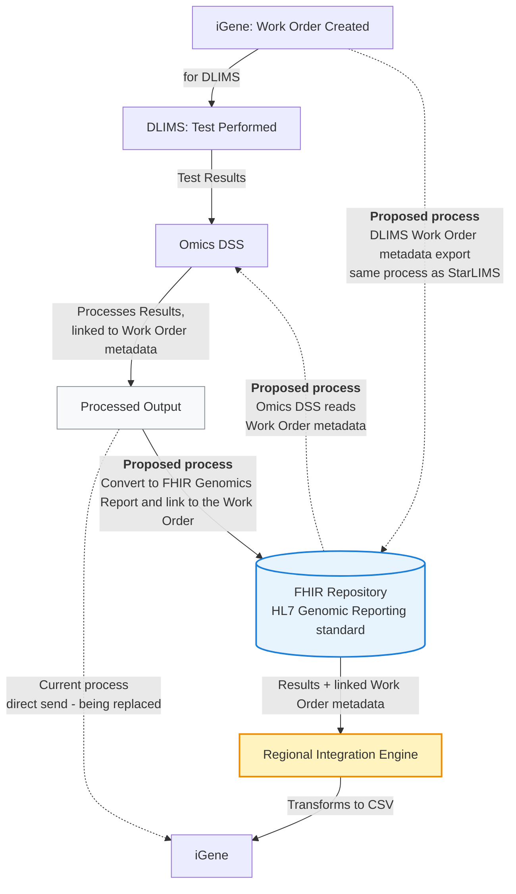

This is currently being elaborated and subject to change.

DSS and iGene Integration Overview.

## References

1. [HL7 Genomic Reporting standard](https://build.fhir.org/ig/HL7/genomics-reporting/)
2. [StarLIMS / iGene Integration](starLIMS.html) - the work order metadata export pattern this mirrors

## Actors

| Actor              | Role                                                    |
|------------------------|----------------------------------------------------------|
| iGene                    | Master LIMS - creates the work order, ultimate destination for processed results |
| DLIMS                     | Satellite LIMS - performs the test against the work order  |
| Omics DSS                 | Processes DLIMS test results, linked to work order metadata |
| FHIR Repository            | Stores the work order and the resulting FHIR Genomics Report |
| Regional Integration Engine (RIE) | Transforms the FHIR Genomics Report into iGene's CSV format |
{:.grid}

## Transactions

| Transaction                         | Description                                             | Direction                          |
|-----------------------------------------|----------------------------------------------------------|---------------------------------------|
| Work Order Created                        | iGene creates a work order for DLIMS                        | iGene → DLIMS                          |
| Test Results                              | DLIMS sends test results for processing                     | DLIMS → Omics DSS                      |
| Work Order metadata export (proposed)     | Mirrors the StarLIMS export pattern                          | iGene → FHIR Repository                |
| Work Order metadata read (proposed)       | So results can be linked back to the originating work order | Omics DSS → FHIR Repository            |
| FHIR Genomics Report (proposed)           | Processed output converted and linked to the Work Order     | Omics DSS → FHIR Repository            |
| CSV transform (proposed)                  | Results + linked Work Order metadata transformed for iGene  | FHIR Repository → RIE → iGene          |
| Processed Output (current, being replaced)| Direct send of processed output                              | Omics DSS → iGene                      |
{:.grid}

## Current Process

The current process works as follows:

1. A work order is created in iGene (for DLIMS)
2. Once the test in DLIMS is complete, the results are sent to Omics DSS
3. Omics DSS processes the results
4. The processed output is sent to iGene

## Future Process

Rather than sending processed output directly to iGene, it will instead be converted to a FHIR Genomics Report and stored in the FHIR Repository, following the HL7 Genomic Reporting standard. The Regional Integration Engine will then transform this data into a format suitable for iGene (likely a CSV file).

For this to work, the DLIMS work order will be exported to the FHIR Repository — mirroring the process already used for StarLIMS — so a copy of the work order is held there. Omics DSS will then access the work order metadata via the FHIR Repository, so results can be correctly linked back to the originating work order.

## Data Models

- [ServiceRequest (Work Order)](StructureDefinition-ServiceRequest.html) - the DLIMS work order exported to the FHIR Repository
- [DiagnosticReport](StructureDefinition-DiagnosticReport.html) - the FHIR Genomics Report Omics DSS produces
- [Variant (Reportable Variant)](StructureDefinition-Variant.html) - the discrete result Observations, following the [HL7 Genomics Reporting IG](https://build.fhir.org/ig/HL7/genomics-reporting/)

## Examples

No example resources are published yet for this scenario.
