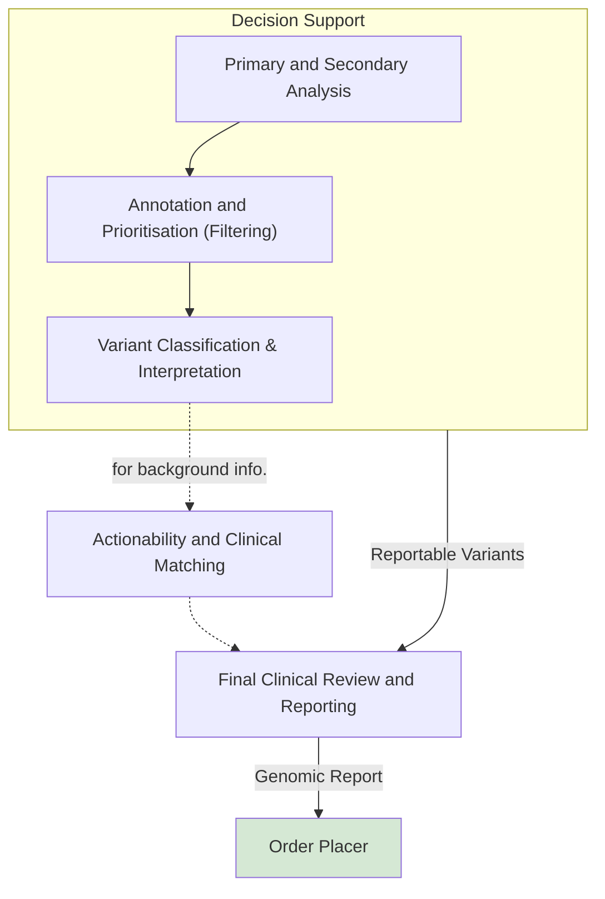

This is currently being elaborated and subject to change.

## Overview 

The process of producing reportable genomic variants using decision support involves filtering massive raw sequencing datasets into actionable, clinically significant mutations. It relies on computational pipelines and clinical knowledge bases to classify variants based on pathogenicity and relevance to a patient's condition.

The step-by-step process operates as follows:

### Primary and Secondary Analysis

Raw sequencing data generated from samples undergoes bioinformatic processing where reads are aligned to a reference genome. This phase performs **variant calling**, identifying the genetic variations present (such as single nucleotide variants or insertions/deletions) when compared to a standard baseline.

### Annotation and Prioritisation (Filtering)

A single genome can contain millions of variants. The Clinical Decision Support System (CDSS) automatically annotates these by appending biological and population context to the variants. It systematically filters out benign background polymorphisms and prioritizes variants based on factors like:

- **Population allele frequency**: Checking databases to see how common a variant is in healthy populations.
- **In silico predictions**: Utilizing computational models to determine if an amino acid change is likely to be functionally damaging.

### Variant Classification & Interpretation

The CDSS evaluates the remaining variants against established clinical guidelines, such as the ACMG/AMP Guidelines for rare diseases or the AMP/ASCO Guidelines for oncology.

Output [Reportable Variant](#reportable-variant)

### Actionability and Clinical Matching

For pathogenic or likely pathogenic variants, the decision support system queries updated clinical trial databases and regulatory-approved biomarker lists (like those from ClinGen). The system matches the variant to specific targeted therapies, identifying if a drug is indicated, contraindicated, or if the patient is eligible for a clinical trial.

### Final Clinical Review and Reporting

Output [Genomic Test Report](Questionnaire-GenomicTestReport.html)

The computational outputs are reviewed by Genomic Clinical Scientists or laboratory scientists who confirm the findings, often utilizing tools such as VarSome to adhere to best practices. The finalized, reportable variants are then populated into a structured, evidence-based report. This report is delivered to the treating physician to guide the patient's personalized treatment or diagnostic journey.

## Reportable Variant

TODO

| Name                       | LOINC   | Value Set / Data Type | Example | Cardinality | HL7 v2 OBX-4 | FHIR [Variant (Observation)](StructureDefinition-Variant.html)] Profile |
|----------------------------|---------|-----------------------|---------|-------------|--------------|-------------------------------------------------------------------------|
| Genetic variant assessment | 69548-6 |                       |         |             |              | Observation.code                                                        |
|                            |         |                       |         |             |              |                                                                         |
|                            |         |                       |         |             |              |                                                                         |
{:grid}

<b>HL7 FHIR Genomic Reporting:</b> <a href="https://build.fhir.org/ig/HL7/genomics-reporting/StructureDefinition-variant.html" _target="_blank">Variant</a> 
 
<b>Localised (NW Genomics) version:</b> <a href="StructureDefinition-Variant.html" _target="_blank">Variant (Observation)</a> 

