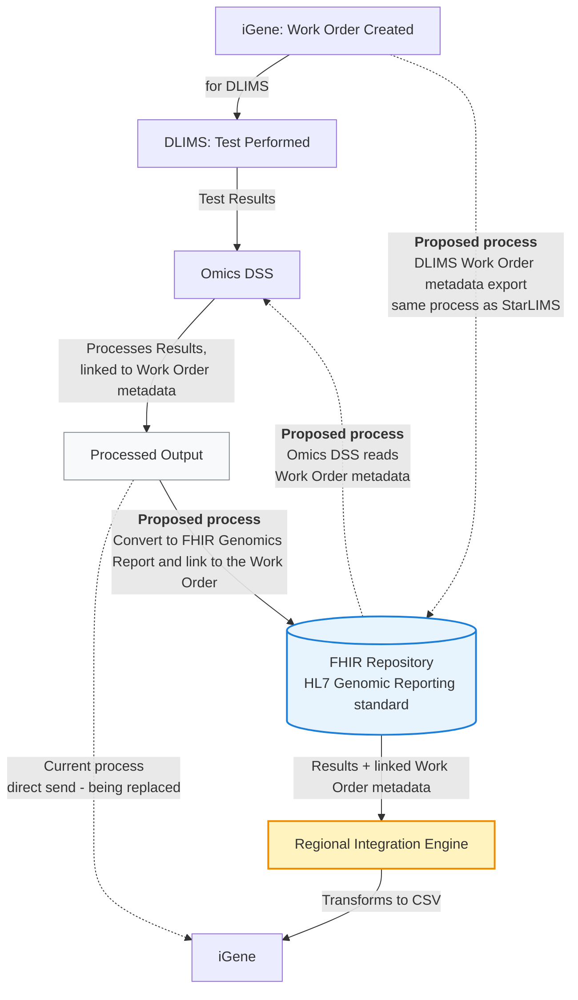

# DSS and iGene Integration Overview

The current process works as follows:

1. A work order is created in iGene (for DLIMS)
2. Once the test in DLIMS is complete, the results are sent to Omics DSS
3. Omics DSS processes the results
4. The processed output is sent to iGene

## Proposed Change

Rather than sending processed output directly to iGene, it will instead be converted to a FHIR Genomics Report and stored in the FHIR Repository, following the HL7 Genomic Reporting standard. The Regional Integration Engine will then transform this data into a format suitable for iGene (likely a CSV file).

For this to work, the DLIMS work order will be exported to the FHIR Repository — mirroring the process already used for StarLIMS — so a copy of the work order is held there. Omics DSS will then access the work order metadata via the FHIR Repository, so results can be correctly linked back to the originating work order.

## Diagram

