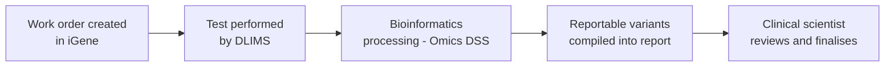
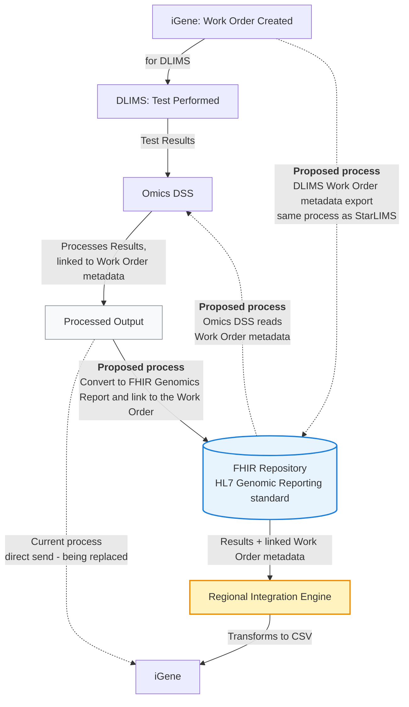
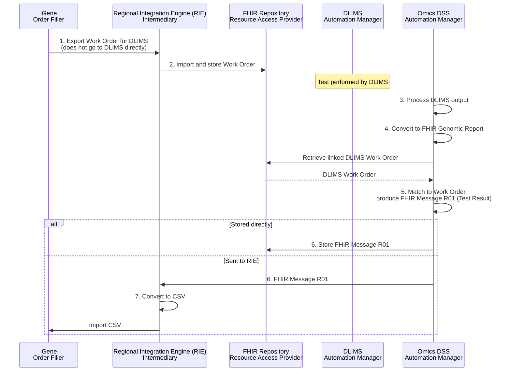

This is currently being elaborated and subject to change.

DSS and iGene Integration Overview.

## References

1. [HL7 Genomic Reporting standard](https://build.fhir.org/ig/HL7/genomics-reporting/)
2. [StarLIMS / iGene Integration](starLIMS.html) - the work order metadata export pattern this mirrors
3. [HL7 Lab Results Interface (LRI), Release 1 from May 2017](https://confluence.hl7.org/download/attachments/25559919/2018%2004%2003%20-%20V2%20LRI%20-%20Ch.%205%20CG%20and%20Code%20System%20Tables.pdf?api=v2) - source for the NTHL1 and CFTR variant examples the [Result Panel](#result-panel) below is partly built from
4. `iGene Custom Fields Master Dataset - Updated 13-Aug-26.xlsx`, "Variant Level Data" sheet (internal iGene specification document, not publicly linked) - the original iGene field spec and LOINC crosswalk the [Result Panel](#result-panel) below is otherwise built from

## Clinical Pathway Overview

### What is being tested

This use case isn't a specific clinical test in its own right - it's the pipeline
that turns a genomic laboratory's raw molecular testing output (from a satellite
LIMS, "DLIMS") into the structured, reportable genomic variants used in a patient's
genomic report. Any DLIMS-processed molecular/NGS test - for example a cancer or
rare disease gene panel - uses this same pattern.

### The end-to-end clinical journey

1. **Work order created** - iGene generates a work order for a specific molecular test as part of processing a patient's sample.
2. **Test performed** - DLIMS carries out the test against the work order.
3. **Bioinformatics processing** - Omics DSS processes the DLIMS output into discrete, reportable variants, linked back to the originating work order.
4. **Report compiled** - iGene incorporates the reportable variants into the patient's genomic report.
5. **Clinical decision** - the reporting clinical scientist/clinician reviews the reportable variants to interpret and finalise the report for the referring clinician.

### Why this matters for developers

- Reportable variants follow the [HL7 Genomics Reporting IG](https://build.fhir.org/ig/HL7/genomics-reporting/)'s discrete `Observation` pattern - not a single free-text result - see [Variant (Reportable Variant)](StructureDefinition-Variant.html).
- The FHIR Repository is the intermediate handoff point between Omics DSS and iGene - Omics DSS doesn't write results back to iGene directly, see [Future Process](#future-process) below.

## Actors

| IHE Actor                                                                | Role                                                    |
|-------------------------------------------------------------------------------|----------------------------------------------------------|
| [Order Filler](ActorDefinition-OrderFiller.html)                                 | iGene - master LIMS, creates the work order, ultimate destination for processed results |
| [Automation Manager](ActorDefinition-AutomationManager.html)                     | DLIMS - satellite LIMS, performs the test against the work order  |
| [Automation Manager](ActorDefinition-AutomationManager.html)                     | Omics DSS - processes DLIMS test results, linked to work order metadata |
| [Resource Access Provider](ActorDefinition-ResourceAccessProvider.html)          | FHIR Repository - stores the work order and the resulting FHIR Genomics Report |
| [Intermediary](ActorDefinition-Intermediary.html)                              | Regional Integration Engine (RIE) - transforms the FHIR Genomics Report into iGene's CSV format |
{:.grid}

## Transactions

| Transaction                                | Description                                             | Direction                          |
|-----------------------------------------------|----------------------------------------------------------|---------------------------------------|
| `LAB-4`                                          | Work order created for DLIMS                                | iGene → DLIMS                          |
| `LAB-5` (current, being replaced)                | DLIMS test results sent for processing, then processed output sent directly to iGene | DLIMS → Omics DSS → iGene |
| FHIR RESTful create (proposed)                   | Work Order metadata export, mirrors the StarLIMS export pattern | iGene → FHIR Repository                |
| FHIR RESTful read (proposed)                     | Work Order metadata read, so results can be linked back to the originating work order | Omics DSS → FHIR Repository |
| `LAB-5` / FHIR RESTful create (proposed)         | Processed output converted to a FHIR Genomics Report and linked to the Work Order | Omics DSS → FHIR Repository |
| CSV transform (proposed)                         | Results + linked Work Order metadata transformed for iGene  | FHIR Repository → RIE → iGene          |
{:.grid}

## Current Process

The current process works as follows:

1. A work order is created in iGene (for DLIMS)
2. Once the test in DLIMS is complete, the results are sent to Omics DSS
3. Omics DSS processes the results
4. The processed output is sent to iGene

## Future Process

Rather than sending processed output directly to iGene, it will instead be converted to a FHIR Genomics Report and stored in the FHIR Repository, following the HL7 Genomic Reporting standard. The Regional Integration Engine will then transform this data into a format suitable for iGene (likely a CSV file).

For this to work, the DLIMS work order will be exported to the FHIR Repository — mirroring the process already used for StarLIMS — so a copy of the work order is held there. Omics DSS will then access the work order metadata via the FHIR Repository, so results can be correctly linked back to the originating work order.

### Detailed Process Flow

1. iGene exports work orders for DLIMS - this export does not go to DLIMS directly.
2. The RIE imports the file and stores it in the FHIR Repository.
3. Once the results have been produced by DLIMS, Omics DSS processes the output.
4. This output is converted to a FHIR Genomic Report.
5. These resources are matched with the DLIMS work order stored in the FHIR Repository, and a FHIR Message R01 (Test Result) is produced.
6. This is either stored directly in the FHIR Repository, or sent to the Regional Integration Engine.
7. The RIE will then convert this into a CSV file to be imported into iGene LIMS.

## Data Models

- [ServiceRequest (Work Order)](StructureDefinition-ServiceRequest.html) - the DLIMS work order exported to the FHIR Repository
- [DiagnosticReport](StructureDefinition-DiagnosticReport.html) - the FHIR Genomics Report Omics DSS produces
- [Variant (Reportable Variant)](StructureDefinition-Variant.html) - the discrete result Observations, following the [HL7 Genomics Reporting IG](https://build.fhir.org/ig/HL7/genomics-reporting/)

### Result Panel

<b>FHIR Questionnaire (Result Panel):</b> <a href="Questionnaire-ReportableVariantResultPanel.html">Reportable Variant Result Panel</a>

iGene models five variant types, each as a fixed, repeating set of custom fields -
`SEQV1`-`SEQV10` (sequence variants), `ICNV1`-`ICNV3` (intragenic copy number
variants), `MCNV1`-`MCNV3` (multigenic copy number variants), `SV1`-`SV3` (structural
variants) and `LOH1`-`LOH2` (loss of heterozygosity) - per the "Variant Level Data"
sheet of iGene's own custom field spec (see [References](#references)). The table
below models each variant type's field set once (the `N` suffix is iGene's own
repetition scheme, not a distinct concept the panel needs to repeat), cross-checked
against this IG's current `Variant` examples: [Variant -
NTHL1](Observation-8385c2fd-313d-4fd5-b98e-d5ea4bae6f99.html) and [Variant -
CFTR](Observation-bca547c1-78a5-41be-8cfc-03c05805ac85.html) (both based on [HL7
LRI](#references) examples), `Observation-EGFR-Variant-ctDNA`, `Observation-BRCA1`,
and the four `Variant` Observations (a small variant, an intragenic CNV, a multi-gene
CNV and a structural variant) in
[Bundle-ctdna9737383222-testresults](Bundle-ctdna9737383222-testresults.html).

| iGene Field           | Sequence Variant                          | Intragenic CNV                            | Multigenic CNV                    | Structural Variant                        | Loss of Heterozygosity |
|------------------------|---------------------------------------------|-----------------------------------------------|---------------------------------------|-----------------------------------------------|----------------------------|
| **Description**       | 51958-7 + 48018-6 + 48004-6 + 48005-3 (one free-text field, all four components) | 51958-7 + 48018-6 + 48004-6 (no amino acid change) | 48001-2 only (chromosome band, no gene/transcript) | 81262-8 "Complex variant HGVS name" *(gap - see below)* | 48018-6 (Gene(s)) |
| **State**              | 53034-5 Allelic State (Zygosity)             | 53034-5 Allelic State (Copy-number state)     | 53034-5 Allelic State (Copy-number state) | 53034-5 Allelic State (Copy-number state)     | No LOINC (LOH Y/N)     |
| **Inheritance**        | No LOINC - ctDNA Bundle uses 94186-4 instead | No LOINC - ctDNA Bundle uses 94186-4 instead  | No LOINC - ctDNA Bundle uses 94186-4 instead | No LOINC                                       | - (not an iGene field) |
| **Level (VAF %)**      | 81258-6 Sample Allelic Frequency             | 81258-6 Sample Allelic Frequency               | 81258-6 Sample Allelic Frequency       | 81258-6 Sample Allelic Frequency               | - (not an iGene field) |
| **Genomic_coordinates**| 48001-2 + 81290-9 (one free-text field)      | 48001-2 + 81290-9 (one free-text field)        | 48001-2 + 81290-9 (one free-text field) | 48001-2 + 81290-9 (one free-text field)        | - (not an iGene field) |
| **Classification**    | 53037-8 Clinical Significance                | 53037-8 Clinical Significance                  | 53037-8 Clinical Significance          | 53037-8 Clinical Significance                  | - (not an iGene field) |
| **Evidence**           | No LOINC - free text                         | No LOINC - free text                           | No LOINC - free text                   | No LOINC - free text                           | - (not an iGene field) |
{:.grid}

Two gaps are not yet resolved:

- **Loss of Heterozygosity** has no current FHIR example at all - its two fields are
  modelled from the iGene spec alone.
- **Structural Variant**: iGene expects one `81262-8` "Complex variant HGVS name"
  field, but the ctDNA Bundle's structural-variant Observation instead spreads the
  same information across several discrete components (Genomic Reference Sequence
  `48013-7`, Coordinate System `92822-6`, Genomic Ref/Alt Allele `69547-8`/`69551-0`,
  DNA Change Type `48019-4`, Genomic DNA Change `81290-9`) - no example yet confirms
  how these decompose into, or recombine into, `81262-8`.

Beyond these coarse iGene fields, the underlying FHIR `Variant` Observations also
carry several more granular components that iGene's own free-text `Description`/
`Genomic_coordinates` fields summarise rather than exposing individually - Genomic
Reference Sequence (`48013-7`), Coordinate System (`92822-6`), Genomic Ref/Alt Allele
(`69547-8`/`69551-0`), DNA Change Type (`48019-4`), Genomic Source Class (`48002-0`),
Origin of Germline Genetic Variant (`94186-4`), Genomic Allele Start-End (`81254-5`)
and Structural Variant Inner Start-End (`81302-2`) - these don't need their own
Result Panel items, since iGene has no discrete field for them, but they remain
significant to the underlying FHIR data model. See [Result Panel: Elements Not
Included](#result-panel-elements-not-included) below for the further HL7 Genomics
Reporting Variant profile elements that neither iGene nor any current example uses at
all.

### Result Panel: Elements Not Included

The HL7 Genomics Reporting [Variant
profile](https://build.fhir.org/ig/HL7/genomics-reporting/StructureDefinition-variant.html)
defines further component slices that neither iGene's own field spec nor any current
example populates - these are deliberately left out of the [Result Panel](#result-panel)
above, since they aren't needed for the iGene feed today:

| Data Element                                | LOINC / Code               |
|-----------------------------------------------|-----------------------------|
| Outer Start-End                               | 81301-4                     |
| Cytogenomic Nomenclature (ISCN)               | 81291-7                     |
| Protein Reference Sequence                    | `protein-ref-seq` (local TBD codesystem) |
| Allelic Read Depth                            | 82121-5                     |
| Evidential Basis for Variant Inheritance      | 82309-6                     |
| Variation Code                                | 81252-9                     |
| Variant Confidence Status                     | `variant-confidence-status` (local TBD codesystem) |
| Repeat Motif                                  | `repeat-motif` (local TBD codesystem) |
| Repeat Number                                 | `repeat-number` (local TBD codesystem) |
| Clinical Conclusion (`conclusion-string`, inherited from [Genomic Observation](StructureDefinition-GenomicObservation.html)) | `conclusion-string` (local TBD codesystem) |
{:.grid}

If a future DLIMS/Omics DSS feed starts populating any of these (for example, read
depth or a repeat-expansion result), or iGene's own spec adds a discrete field for
one, the corresponding item should move up into the [Result Panel](#result-panel)
above, following the same "only what is currently used" rule.

## Examples

| Source                                                                                                                    | Example                                                                                                                       |
|--------------------------------------------------------------------------------------------------------------------------|--------------------------------------------------------------------------------------------------------------------------------|
| GA4GH VCF (input) - see the [VCF v4.3 specification](https://samtools.github.io/hts-specs/VCFv4.3.pdf)                   | [igene_example_data.vcf](https://github.com/nw-gmsa/Testing/blob/main/Input/DSS/VCF/igene_example_data.vcf)                    |
| GA4GH Phenopacket (input) - see the [Phenopacket schema documentation](https://phenopacket-schema.readthedocs.io/en/latest/) | [igene_example_data.phenopacket.json](https://github.com/nw-gmsa/Testing/blob/main/Input/DSS/VCF/igene_example_data.phenopacket.json) |
| FHIR `Bundle` (NW-GMSA `R01` Test Results message) - produced from the VCF/Phenopacket above by notebook [05 - Test Results: GA4GH VCF to FHIR Genomics Reporting](https://github.com/nw-gmsa/Testing/blob/main/notebooks/05-test-results-from-vcf.ipynb) | [Bundle-ctdna9737383222-testresults](Bundle-ctdna9737383222-testresults.html) |
{:.grid}

## Developer Guides

- [02 - Work Orders: A Worked Example](https://github.com/nw-gmsa/Testing/blob/main/notebooks/02-work-orders-worked-example.ipynb) - retrieving the DLIMS Work Orders from the FHIR Repository, the metadata Omics DSS links its results back to
- [05 - Test Results: GA4GH VCF to FHIR Genomics Reporting](https://github.com/nw-gmsa/Testing/blob/main/notebooks/05-test-results-from-vcf.ipynb) - converts a GA4GH VCF file into discrete `variant` Observations conforming to the HL7 Genomics Reporting IG, plus an NW-GMSA `R01` Test Results message

See [Developer Guides](DeveloperGuides.html) for the full notebook series.
