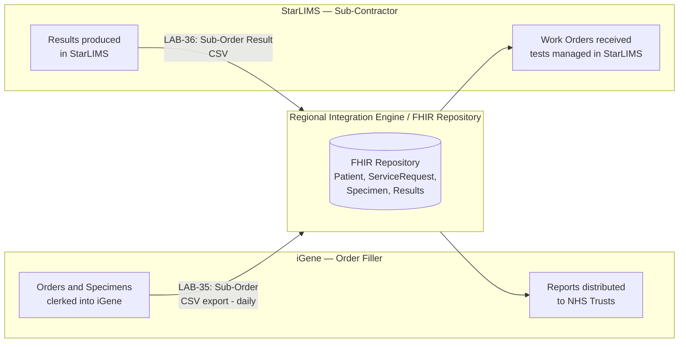
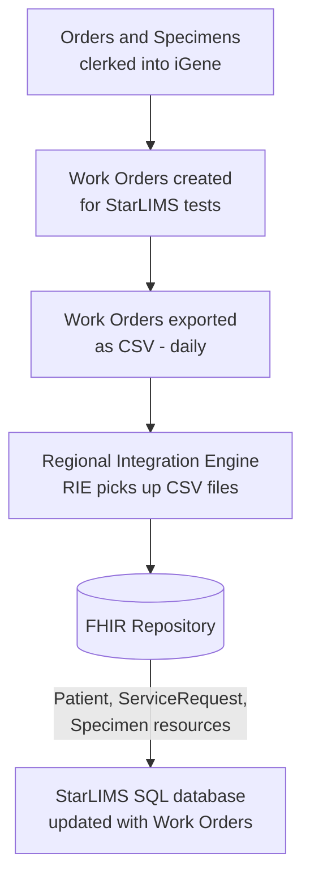
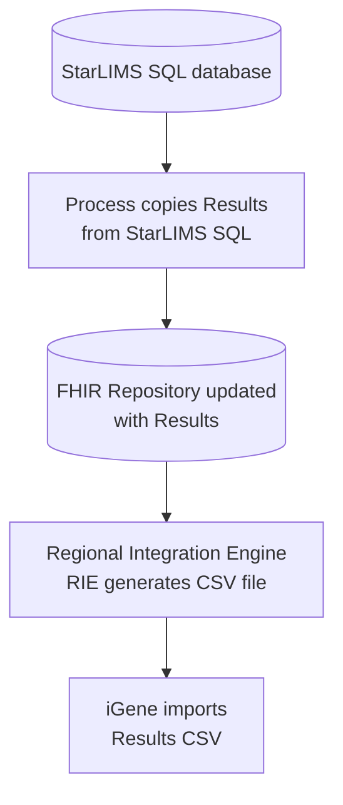

# NW Genomics — StarLIMS / iGene Integration

## Current Situation

North West Genomics was formed from two Genomic Laboratory Hubs — one in Manchester and one in Liverpool. Many tests for Liverpool hospitals were historically processed in Liverpool using StarLIMS at the Liverpool GLH.

The move to a single organisation includes consolidating onto one master LIMS, iGene. For ordering and reporting, this means:

- Orders and specimens are clerked into iGene. Most orders arrive on paper, though a growing number of NHS Trusts in the region now send electronic orders (IHE LAB-1). Some tests are allocated to satellite LIMS, and these are referred to as work orders.
- Reports still originate from a variety of LIMS in multiple formats, though this is also being centralised in iGene. NW Genomics is moving towards electronic transmission (HL7 ORU / IHE LAB-3, with FHIR Laboratory Report support planned) to return reports to NHS Trusts.

## Proposed Solution

Work orders are currently entered into StarLIMS manually; this process will be automated. The data transferred includes patient demographics (NHS number, gender, date of birth, name), order details (placer and filler order numbers), and specimen information (type and identifier). Results will flow from StarLIMS to iGene, and from there be distributed to NHS hospitals.

The overall design is broadly the same as the IHE Inter Laboratory Workflow, with StarLIMS acting as the Sub-Contractor and iGene acting as the Order Filler. The order process described above corresponds to transaction LAB-35, and the result process corresponds to LAB-36.

This fits inside the IHE Laboratory Testing Workflow, as illustrated at [nw-gmsa.github.io/en/ILW.html#sub-orders-lab-35-and-lab-36](https://nw-gmsa.github.io/en/ILW.html#sub-orders-lab-35-and-lab-36).

### Overall Workflow

The data model in the FHIR Repository conforms to a North West "data contract", which is documented at [nw-gmsa.github.io/en/index.html](https://nw-gmsa.github.io/en/index.html). All resources must pass FHIR Validation using this implementation guide. Details on how to test resources against the FHIR profiles can be found at [nw-gmsa.github.io/en/testing.html#fhir-validation](https://nw-gmsa.github.io/en/testing.html#fhir-validation).

## Orders

The initial design for handling work orders is as follows:

1. Orders and specimens are clerked into iGene.
2. Work orders for StarLIMS are generated, with specific tests managed within StarLIMS.
3. Work orders are exported as CSV files on a daily basis.
4. The regional integration engine (RIE) picks up these files and stores them in the FHIR Repository as Patient, ServiceRequest, and Specimen resources. Details of this data model are available at [nw-gmsa.github.io/en/diagnostic-core.html](https://nw-gmsa.github.io/en/diagnostic-core.html).
5. A process then updates the StarLIMS SQL database with the work orders.

## Results

The results workflow has not yet been designed, but the expectation is that a process will copy results from the StarLIMS SQL database into the FHIR Repository, after which the RIE will generate a CSV file for import into iGene.

> **Note:** the Results process is anticipated, not yet finalised.
