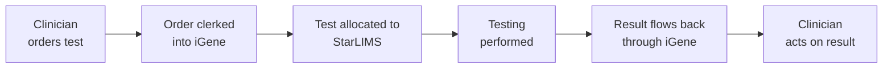
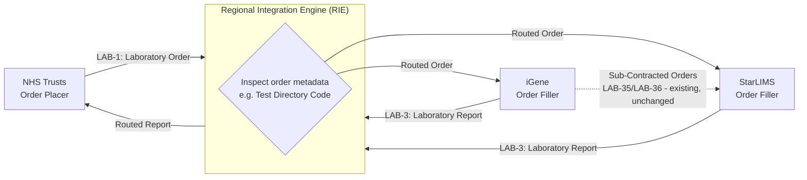
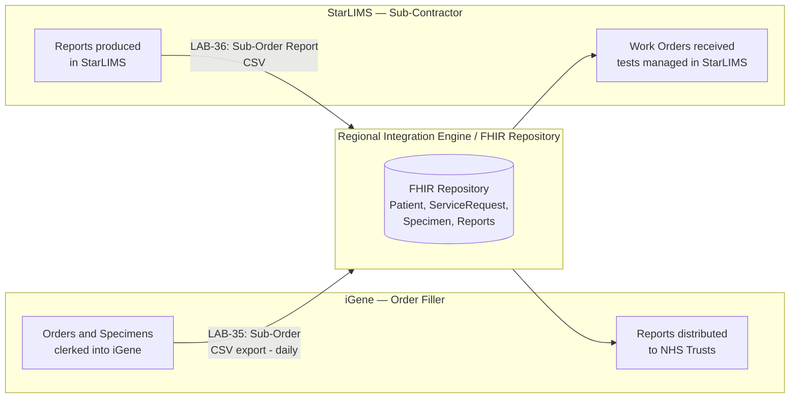
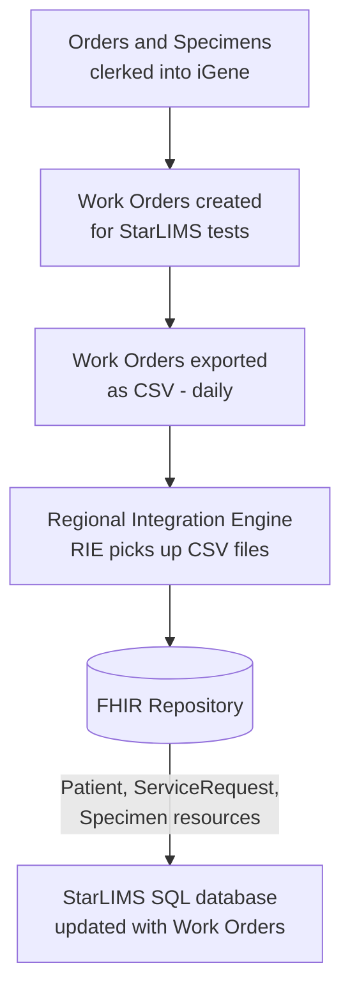
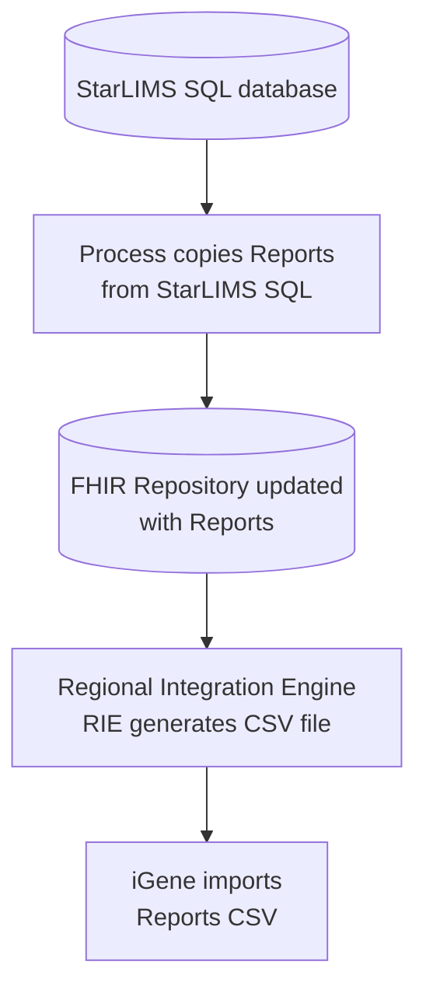

This is currently being elaborated and subject to change.

NW Genomics — StarLIMS / iGene Integration.

## References

1. [Inter Laboratory Workflow (ILW) - Sub-orders LAB-35 and LAB-36](ILW.html#sub-orders-lab-35-and-lab-36)
2. [Diagnostic Core](diagnostic-core.html)
3. [Regional Integration Engine (RIE)](overview.html)
4. [FHIR Validation](testing.html#fhir-validation)
5. [nw-gmsa.github.io/en/index.html](https://nw-gmsa.github.io/en/index.html) - the North West "data contract" all FHIR Repository resources must conform to
6. [02 - Work Orders: A Worked Example](https://github.com/nw-gmsa/Testing/blob/main/notebooks/02-work-orders-worked-example.ipynb) - worked example of retrieving orders from the Resource Access Provider (FHIR Repository), the mechanism used by both the existing sub-contracting path and the future RIE-routed path (see [Developer Guides](DeveloperGuides.html))

## Clinical Pathway Overview

### What is being tested

This use case isn't about a specific clinical test - it's about how a test
allocated to StarLIMS (the Liverpool GLH's satellite LIMS) gets its order and
result moved correctly between iGene (the master LIMS) and StarLIMS, so which
system actually processes the test stays invisible to the referring clinician.

### The end-to-end clinical journey

1. **Order placed** - a clinician orders a genomic test, the same way regardless of which LIMS will eventually process it.
2. **Order clerked into iGene** - the order is entered into the master LIMS.
3. **Test allocated to StarLIMS** - some tests are work-ordered to StarLIMS for processing.
4. **Testing performed** - StarLIMS carries out the test.
5. **Result flows back** - the result returns to iGene, and from there to the ordering clinician.
6. **Clinical decision** - the clinician acts on the result, without needing to know which LIMS actually ran it.

### Why this matters for developers

- Whether a test runs on iGene or StarLIMS is purely an internal allocation decision - it should never be visible in what the referring clinician receives.
- A "work order" is a different concept from the original Laboratory Order (`LAB-1`): the work order is the internal routing of a specific test to whichever system (StarLIMS or otherwise) will actually process it.

## Actors

| IHE Actor                                                                                                                   | Role                                                                                                                                                                                                        |
|-----------------------------------------------------------------------------------------------------------------------------|-------------------------------------------------------------------------------------------------------------------------------------------------------------------------------------------------------------|
| [Order Placer](ActorDefinition-OrderPlacer.html)                                                                            | NHS Trusts - send Laboratory Orders (LAB-1), receive Laboratory Reports (LAB-3)                                                                                                                             |
| [Order Filler](ActorDefinition-OrderFiller.html)                                                                            | iGene (master LIMS) - orders and specimens are clerked in, reports distributed to NHS Trusts                                                                                                                |
| [Resource Access Provider](ActorDefinition-ResourceAccessProvider.html) / [Intermediary](ActorDefinition-Intermediary.html) | FHIR Repository + Regional Integration Engine (RIE) - picks up work order CSV exports, stores Patient/ServiceRequest/Specimen, generates reports CSV (existing sub-contracting path)                                                         |
| [Intermediary](ActorDefinition-Intermediary.html)                                                                           | Regional Integration Engine (RIE) - inspects and routes Laboratory Orders (LAB-1) and Laboratory Reports (LAB-3) between NHS Trusts and iGene/StarLIMS, based on order metadata such as Test Directory Code |
| [Subcontractor](ActorDefinition-Subcontractor.html) (ILW) / [Order Filler](ActorDefinition-OrderFiller.html) (future)       | StarLIMS - Liverpool GLH satellite LIMS, tests managed here. Sub-Contractor for iGene-routed work orders (existing); Order Filler for orders routed here directly by the RIE (future)                       |
{:.grid}

## Transactions

| Transaction    | Description                                              | Direction               |
|--------------------|-------------------------------------------------------------|-----------------------------|
| `LAB-1`/`LAB-3` (current)      | Orders/specimens clerked into iGene; reports distributed to NHS Trusts | NHS Trusts ↔ iGene            |
| `LAB-1`/`LAB-3` (future, routed) | RIE inspects order metadata (e.g. Test Directory Code) and routes Laboratory Orders to iGene or StarLIMS as Order Filler; routes Laboratory Reports back to the originating NHS Trust | NHS Trusts ↔ RIE ↔ iGene/StarLIMS |
| `LAB-4`              | Work orders generated for StarLIMS tests                       | iGene → StarLIMS (via RIE, CSV export) |
| `LAB-35`/`LAB-36`    | Sub-order and Laboratory Report (StarLIMS as Sub-Contractor, iGene as Order Filler) | iGene ↔ StarLIMS               |
{:.grid}

## Current Process

North West Genomics was formed from two Genomic Laboratory Hubs — one in Manchester and one in Liverpool. Many tests for Liverpool hospitals were historically processed in Liverpool using StarLIMS at the Liverpool GLH.

The move to a single organisation includes consolidating onto one master LIMS, iGene. For ordering and reporting, this means:

- Orders and specimens are clerked into iGene. Most orders arrive on paper, though a growing number of NHS Trusts in the region now send electronic orders (IHE LAB-1). Some tests are allocated to satellite LIMS, and these are referred to as work orders.
- Reports still originate from a variety of LIMS in multiple formats, though this is also being centralised in iGene. NW Genomics is moving towards electronic transmission (HL7 ORU / IHE LAB-3, with FHIR Laboratory Report support planned) to return reports to NHS Trusts.

## Future Process

Two future developments are planned for StarLIMS integration:

- **Order and Report Routing** - the Regional Integration Engine (RIE) will receive Laboratory Orders (LAB-1) directly from NHS Trusts and route each one to iGene or StarLIMS, in addition to the existing sub-contracting path from iGene.
- **Automated Sub-Contracted Orders** - the existing sub-contracting path, where iGene routes selected work orders to StarLIMS, moves from manual entry to an automated feed.

### Order and Report Routing

This is a future development.

<b>Use Case:</b> This extends the existing <a href="overview.html">Regional Integration Engine (RIE)</a> use case. Today, that use case only covers Laboratory Orders (LAB-1) routed from NHS Trusts to iGene, and Laboratory Reports (LAB-3) routed from iGene back to NHS Trusts. This development adds StarLIMS as a second routing destination/source alongside iGene.

Today, NHS Trusts (Order Placer) send Laboratory Orders (LAB-1) to iGene (Order Filler), and iGene alone decides - internally - which orders to sub-contract to StarLIMS (see Sub-Contracted Orders below). As a further future development, the RIE will sit in the LAB-1/LAB-3 path itself: it will receive Laboratory Orders directly from NHS Trusts, inspect order metadata such as the Test Directory Code, and route each order to whichever system - iGene or StarLIMS - is the correct Order Filler for that test.

The existing sub-contracting process from iGene to StarLIMS is unaffected and continues to exist alongside this - it is, in effect, a second, iGene-internal routing step for orders the RIE has already routed to iGene.

For StarLIMS, the mechanism for receiving these RIE-routed orders is the same as receiving iGene's sub-contracted orders today: StarLIMS picks them up by querying the Resource Access Provider (FHIR Repository), as described in [Overall Workflow (Sub-Contracted Orders)](#overall-workflow-sub-contracted-orders) below - there is no new, bespoke integration for the NHS Trust-routed case. The two are distinguished in the FHIR Repository by `ServiceRequest.intent`: RIE-routed Laboratory Orders (LAB-1) use `order`, while iGene's sub-contracted orders (LAB-35) use `filler-order`.

Laboratory Reports follow the same pattern in reverse. The process that populates the FHIR Repository from a Laboratory Report is unchanged (see Subcontracted Laboratory Report below for the sub-contracting case); what's new is that the RIE also acts as a router, forwarding each Laboratory Report on to the NHS Trust that originally placed the order.

### Automated Sub-Contracted Orders

Work orders are currently entered into StarLIMS manually; this process will be automated. The data transferred includes patient demographics (NHS number, gender, date of birth, name), order details (placer and filler order numbers), and specimen information (type and identifier). Reports will flow from StarLIMS to iGene, and from there be distributed to NHS hospitals.

The overall design is broadly the same as the IHE Inter Laboratory Workflow, with StarLIMS acting as the Sub-Contractor and iGene acting as the Order Filler. The order process described above corresponds to transaction LAB-35, and the report process corresponds to LAB-36.

This fits inside the IHE Laboratory Testing Workflow, as illustrated at [nw-gmsa.github.io/en/ILW.html#sub-orders-lab-35-and-lab-36](https://nw-gmsa.github.io/en/ILW.html#sub-orders-lab-35-and-lab-36).

### Overall Workflow (Sub-Contracted Orders)

### Subcontracted Orders

The initial design for handling work orders is as follows:

1. Orders and specimens are clerked into iGene.
2. Work orders for StarLIMS are generated, with specific tests managed within StarLIMS.
3. Work orders are exported as CSV files on a daily basis.
4. The regional integration engine (RIE) picks up these files and stores them in the FHIR Repository as Patient, ServiceRequest, and Specimen resources. Details of this data model are available at [nw-gmsa.github.io/en/diagnostic-core.html](https://nw-gmsa.github.io/en/diagnostic-core.html).
5. A process then updates the StarLIMS SQL database with the work orders.

### Subcontracted Laboratory Report

The reports workflow has not yet been designed, but the expectation is that a process will copy reports from the StarLIMS SQL database into the FHIR Repository, after which the RIE will generate a CSV file for import into iGene.

> **Note:** the Reports process is anticipated, not yet finalised.

## Data Models

- [ServiceRequest](StructureDefinition-ServiceRequest.html) - work orders (placer and filler order numbers)
- [Specimen](StructureDefinition-Specimen.html) - specimen type and identifier
- [Patient](StructureDefinition-Patient.html) - NHS number, gender, date of birth, name

## Examples

No example resources are published yet for this scenario.

## Developer Guides

- [02 - Work Orders: A Worked Example](https://github.com/nw-gmsa/Testing/blob/main/notebooks/02-work-orders-worked-example.ipynb) - worked example of retrieving orders from the Resource Access Provider (FHIR Repository), the mechanism used by both the existing sub-contracting path and the future RIE-routed path

See [Developer Guides](DeveloperGuides.html) for the full notebook series.
